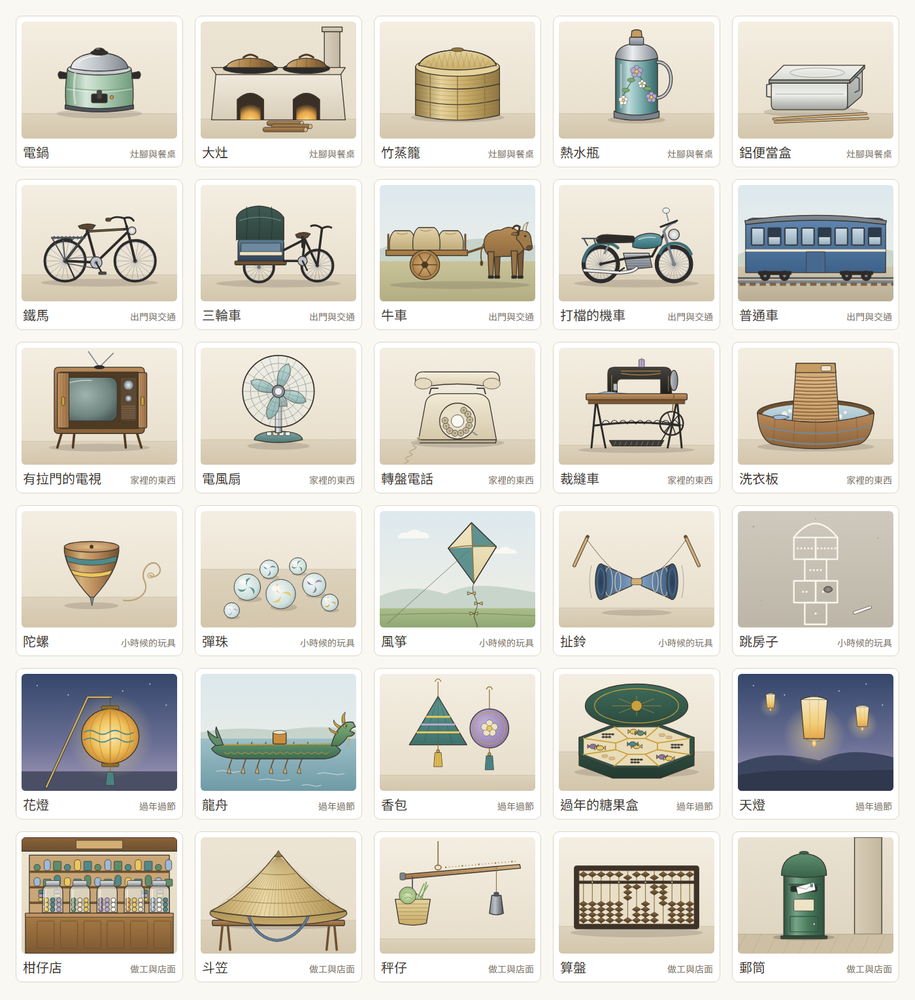

# 透析中的遊戲化之三：記憶相簿的主題

版本：v0.1　文件狀態：草案（2026-10-11 開立）　適用讀者：院方（護理部、社工）、FDE 工程團隊

上層文件：《[透析中的遊戲化之一：決定、開關與實作順序](dialysis-gamification-decisions.md)》第 5.2 節

---

## 0. 本文件的定位

遊戲化決定 5.2 規定：老台灣記憶相簿的圖由 AI 畫，**畫之前先寫一份分析子文件**，判斷主題怎麼分、每類畫哪些物件、要避開哪些題材與「可能讓人難過」的判斷準則、選項與說明文字怎麼寫，以及第一年之後每一季加什麼。這一份就是那份子文件，也是實作規格書 4.23（迭代 23）「開工第一件事」。

**這一份不是需求文件。** 需求在 SRS FR-P16、FR-S17 與實作規格書 4.23；這裡只決定內容。圖卡的文字以 `@hd/shared` 的 `album.ts` 為準（迭代 23.3 起是首次啟動時寫進資料表的預設值，之後以資料表為準，實作規格書 3.14 第 5 條），這一份改了要同步改那裡。

迭代 23 因為畫圖的量大，切成三次子迭代，切法與每一次的交接寫在《[迭代 23 的三次子迭代](iteration-23-split.md)》。

---

## 1. 選物件的六條準則

| # | 準則 | 為什麼 |
|---|---|---|
| 1 | **一般家庭的日常生活**：灶腳、交通、家裡的器物、童玩、年節、做工與店面 | 長輩在這裡是「懂的人」（上層 7.1）；日常的東西人人有份，不會有人因為「我家沒有」而覺得被排除 |
| 2 | **台灣慣用的叫法**，台語常用的詞寫成通行的國字（灶腳、鐵馬、柑仔店、秤仔、尪仔標） | 長輩自己怎麼叫就怎麼寫；不用中國大陸的叫法，照迭代 17.3 的用語把關 |
| 3 | **畫物件、不畫人** | 不畫可辨識的真人（上層 7.1），連剪影也不畫臉；布袋戲偶、舞獅頭這類「物件」可以 |
| 4 | **只畫樣子、不畫商標與招牌字** | 電鍋畫的是那個淡綠色、兩隻黑耳朵的樣子，不是它的商標；店面的招牌留白（遊戲化決定 5.2） |
| 5 | **不用紅色** | 病人端紅色只給求助按鈕（《介面設計基準》4.1）。本來就是紅色的東西（春聯、紅包、紅色郵筒）起始先不收；郵筒畫綠色的那一種 |
| 6 | **畫得出來、認得出來** | 圖是程式產生的向量圖（第 7 節），要有一眼就分得出來的輪廓；需要細部文字才認得的東西（車票上的字、日曆上的數字）起始先放在第二批，畫的時候以形狀代替文字 |

---

## 2. 主題

起始六個主題，每個主題 10 張。主題以代號存，**留得下以後新增的主題**（第 9 節）：

| 代號 | 主題（病人看到的） | 收什麼 |
|---|---|---|
| `KITCHEN` | 灶腳與餐桌 | 煮飯、裝東西、帶便當的器具；**不收食物本身**（第 3 節第 6 條） |
| `TRAVEL` | 出門與交通 | 腳踏車、三輪車、牛車、火車、客運、竹筏 |
| `HOME` | 家裡的東西 | 電器、家具、洗衣、睡覺用的東西 |
| `PLAY` | 小時候的玩具 | 不用買或很便宜的童玩 |
| `FESTIVAL` | 過年過節 | 元宵、端午、過年的物件與熱鬧的場合；**不收祭祀** |
| `WORK` | 做工與店面 | 種田、做生意、算帳、寄信 |

上層 7.1 舉的「家庭」改成「家裡的東西」：家庭關係（父母、孩子）用畫的一定要畫人，而且最容易勾起失去的回憶；家裡的器物一樣能讓人想起家人，但由病人自己決定要不要點「想起某個人」。

---

## 3. 要避開的題材與「可能讓人難過」的判斷準則

**判斷準則**：看到這張圖，**第一個想到的是不是日常生活裡的事**。會先想到失去、病痛、戰亂、被羞辱，或要先想「這是哪一邊的」的，不收；拿不準的先不收，交給社工看（第 10 節第 1 題）。

| # | 不收 | 例子 | 為什麼 |
|---|---|---|---|
| 1 | 戰爭與軍事 | 防空洞、軍服、配給、眷村的軍方標誌 | 上層 7.1；有人經歷過轟炸與離散 |
| 2 | 政治與選舉 | 旗幟、黨徽、標語、領袖肖像、選舉旗 | 上層 7.1；透析室裡不同立場的人每週見三次 |
| 3 | 重大歷史事件與災害 | 二二八、戒嚴、八七水災、九二一、礦災 | 上層 7.1；可能是親身的創傷 |
| 4 | 病、醫療、死亡 | 醫院、打針、藥包、告別式、紙錢、掃墓、中元普渡 | **透析病人每週來醫院三次**，相簿是要讓人暫時離開這件事 |
| 5 | 宗教儀式本身 | 拜拜、神像、香爐 | 病人的信仰不同；廟口的戲台、舞獅這類熱鬧場合可以（第 4.5 節） |
| 6 | 透析病人要限制的吃喝 | 楊桃、香蕉、柳丁、汽水、冰棒、整桌的菜 | 透析病人有鉀、磷與水分的限制，楊桃更是會出事；看得到吃不到的圖不是回憶是折磨。灶腳畫器具，「辦桌」畫的是棚子與圓桌 |
| 7 | 菸、酒、檳榔、賭 | 菸酒公賣的瓶子、檳榔攤、大家樂 | 與疾病相關，也容易變成說教 |
| 8 | 貧窮與羞辱 | 「窮到沒飯吃」的情境、補丁衣 | 「懂的人」不該是「吃過苦的人」；說明文字也不寫「以前很窮」 |
| 9 | 族群標籤 | 以特定族群的服飾、器物當題目 | 容易變成刻板印象；起始先不收，以後由社工與病友提名（第 9 節） |

驗收腳本把這張表的字詞寫成一份清單，逐字比對每一張圖卡的名稱、選項與說明（`verify:iteration23-1` 步驟 2）。**圖本身要靠人看**：第 6 節的逐張檢查。

---

## 4. 起始的 60 張

「熟悉度」1 是第一眼就認得、2 是大多數人認得、3 是比較少見（第 8 節的出卡順序用它）。「這是什麼？」的三個選項照表上的順序顯示，答案是粗體。「批」是哪一次子迭代畫的：第一批 23.1 已畫好、第二批 23.2 畫。

### 4.1 灶腳與餐桌

| 代號 | 名稱 | 題型 | 熟悉度 | 選項 | 一句說明（病人看到的） | 批 |
|---|---|---|---|---|---|---|
| `RICE_COOKER` | 電鍋 | 有沒有 | 1 | — | 外鍋加一杯水、按下開關，飯就煮好了，也能蒸菜、熱便當 | 1 |
| `STOVE` | 大灶 | 是什麼 | 1 | 磚窯／**大灶**／水井 | 以前燒柴煮飯的大灶，灶腳就是廚房 | 1 |
| `STEAMER` | 竹蒸籠 | 是什麼 | 1 | **竹蒸籠**／竹簍／米篩 | 一層一層疊起來，蒸包子、蒸粿都靠它 | 1 |
| `THERMOS` | 熱水瓶 | 有沒有 | 1 | — | 早上燒一壺開水倒進去，到晚上還是熱的 | 1 |
| `LUNCHBOX` | 鋁便當盒 | 是什麼 | 1 | 餅乾盒／鉛筆盒／**鋁便當盒** | 上學帶的便當，中午放進蒸飯箱一起蒸 | 1 |
| `BIG_BOWL` | 碗公 | 有沒有 | 2 | — | 大大的碗公，裝麵、裝湯，一家人共用 | 2 |
| `CUPBOARD` | 菜櫥 | 是什麼 | 2 | 衣櫥／**菜櫥**／書櫃 | 紗網透氣又擋蒼蠅，吃剩的菜收在裡面 | 2 |
| `RICE_JAR` | 米甕 | 有沒有 | 2 | — | 裝米的大甕，蓋子一掀，用米杯一杯一杯舀 | 2 |
| `KUEH_MOLD` | 粿印 | 是什麼 | 3 | 印章盒／月餅模／**粿印** | 做紅龜粿的木頭模子，壓出龜殼的花紋 | 2 |
| `TEA_SET` | 泡茶的茶盤 | 有沒有 | 2 | — | 客人來了先泡一壺茶，小小的杯子一杯一杯倒 | 2 |

### 4.2 出門與交通

| 代號 | 名稱 | 題型 | 熟悉度 | 選項 | 一句說明（病人看到的） | 批 |
|---|---|---|---|---|---|---|
| `BICYCLE` | 鐵馬 | 有沒有 | 1 | — | 後座有載貨的鐵架，載過米，也載過孩子 | 1 |
| `TRICYCLE` | 三輪車 | 是什麼 | 1 | 人力車／**三輪車**／鐵牛車 | 以前在街上載客，客人坐的位子有車篷 | 1 |
| `OX_CART` | 牛車 | 是什麼 | 1 | **牛車**／馬車／板車 | 牛拉的木板車，載甘蔗、載稻穀 | 1 |
| `MOTORCYCLE` | 打檔的機車 | 有沒有 | 1 | — | 腳踩換檔，一台車載全家人出門 | 1 |
| `BLUE_TRAIN` | 普通車 | 是什麼 | 2 | 莒光號／自強號／**普通車** | 藍色的車廂、窗戶打得開，每一站都停 | 1 |
| `SUGAR_TRAIN` | 五分車 | 是什麼 | 2 | **五分車**／纜車／普通車 | 載甘蔗的小火車，鐵軌比一般的窄一半 | 2 |
| `RAIL_CROSSING` | 平交道 | 是什麼 | 2 | 收費站／**平交道**／車站月台 | 火車要來時噹噹響，柵欄慢慢放下來 | 2 |
| `RAFT` | 竹筏 | 是什麼 | 2 | 龍舟／舢舨／**竹筏** | 一根根竹子綁在一起，在河邊、海邊捕魚載人 | 2 |
| `CARD_TICKET` | 火車票 | 是什麼 | 3 | **火車票**／名片／電影票 | 小小一張硬紙板，進站時剪一個缺口 | 2 |
| `BUS` | 公路局的客運 | 是什麼 | 2 | 遊覽車／**公路局的客運**／卡車 | 車掌小姐剪票、喊站名，一站一站停 | 2 |

第一批的交通只有四張熟悉度 1，第五張排熟悉度 2 的普通車。

### 4.3 家裡的東西

| 代號 | 名稱 | 題型 | 熟悉度 | 選項 | 一句說明（病人看到的） | 批 |
|---|---|---|---|---|---|---|
| `TV_CABINET` | 有拉門的電視 | 有沒有 | 1 | — | 木頭外殼、有兩扇拉門，轉台要走過去轉 | 1 |
| `FAN` | 電風扇 | 有沒有 | 1 | — | 鐵網罩、會左右擺頭，夏天全家圍著吹 | 1 |
| `DIAL_PHONE` | 轉盤電話 | 是什麼 | 1 | 收音機／**轉盤電話**／鬧鐘 | 手指伸進圓孔一個一個轉，號碼長就轉很久 | 1 |
| `SEWING_MACHINE` | 裁縫車 | 有沒有 | 1 | — | 腳踩踏板，在燈下車衣服、補褲子 | 1 |
| `WASHBOARD` | 洗衣板 | 是什麼 | 1 | 砧板／竹蓆／**洗衣板** | 在木盆裡搓衣服，一件一件洗 | 1 |
| `RADIO` | 收音機 | 有沒有 | 2 | — | 聽廣播、聽歌仔戲、聽講古 | 2 |
| `PENDULUM_CLOCK` | 擺鐘 | 有沒有 | 2 | — | 掛在牆上，整點會噹噹響，要定時上發條 | 2 |
| `TEAR_CALENDAR` | 撕的日曆 | 有沒有 | 2 | — | 一天撕一張，背面還能拿來寫字 | 2 |
| `RATTAN_CHAIR` | 籐椅 | 有沒有 | 2 | — | 坐起來涼，夏天搬到門口乘涼 | 2 |
| `MOSQUITO_NET` | 蚊帳 | 有沒有 | 2 | — | 睡前放下來、塞進蓆子底下，蚊子就進不來 | 2 |

### 4.4 小時候的玩具

| 代號 | 名稱 | 題型 | 熟悉度 | 選項 | 一句說明（病人看到的） | 批 |
|---|---|---|---|---|---|---|
| `TOP` | 陀螺 | 是什麼 | 1 | **陀螺**／扯鈴／毽子 | 繩子一圈一圈纏好，用力一甩，在地上轉很久 | 1 |
| `MARBLES` | 彈珠 | 是什麼 | 1 | 糖果／**彈珠**／鈕扣 | 玻璃珠裡有彩色的花紋，在地上彈來彈去 | 1 |
| `KITE` | 風箏 | 是什麼 | 1 | 竹蜻蜓／紙飛機／**風箏** | 竹子做骨架、糊上紙，在田邊放得很高 | 1 |
| `DIABOLO` | 扯鈴 | 是什麼 | 1 | **扯鈴**／陀螺／跳繩 | 兩根棍子一條線，讓它在線上轉，拋高再接住 | 1 |
| `HOPSCOTCH` | 跳房子 | 是什麼 | 1 | 下棋／**跳房子**／踢毽子 | 用粉筆在地上畫格子，丟一顆小石頭，單腳跳過去 | 1 |
| `BAMBOO_COPTER` | 竹蜻蜓 | 是什麼 | 2 | 風車／風箏／**竹蜻蜓** | 雙手一搓，竹片就飛上天 | 2 |
| `POG` | 尪仔標 | 是什麼 | 2 | **尪仔標**／郵票／銅板 | 圓圓的厚紙片，用自己的去拍翻別人的 | 2 |
| `BEANBAGS` | 沙包 | 是什麼 | 2 | 香包／**沙包**／枕頭 | 布縫的小袋子裝沙或豆子，丟高再抓起來 | 2 |
| `TIN_STILTS` | 鐵罐高蹺 | 是什麼 | 3 | 傳聲筒／水桶／**鐵罐高蹺** | 兩個空罐子綁上繩子，踩著走路叩叩響 | 2 |
| `JUMP_RUBBER` | 跳橡皮筋 | 是什麼 | 2 | **跳橡皮筋**／跳繩／呼拉圈 | 橡皮筋一條一條串起來，越跳越高 | 2 |

尪仔標上的圖案只畫花紋與幾何圖形，不畫任何卡通人物（著作權）。

### 4.5 過年過節

| 代號 | 名稱 | 題型 | 熟悉度 | 選項 | 一句說明（病人看到的） | 批 |
|---|---|---|---|---|---|---|
| `LANTERN` | 花燈 | 是什麼 | 1 | 天燈／**花燈**／風箏 | 元宵節提著花燈出門，看誰的最漂亮 | 1 |
| `DRAGON_BOAT` | 龍舟 | 是什麼 | 1 | **龍舟**／竹筏／漁船 | 端午節划龍舟，鑼鼓聲一下一下 | 1 |
| `SACHET` | 香包 | 是什麼 | 1 | 沙包／錢包／**香包** | 端午節掛在胸前的小香包，有香草的味道 | 1 |
| `CANDY_BOX` | 過年的糖果盒 | 有沒有 | 1 | — | 擺在客廳，一格一格裝糖果、瓜子招待客人 | 1 |
| `SKY_LANTERN` | 天燈 | 是什麼 | 1 | 熱氣球／花燈／**天燈** | 在紙上寫下心願，點了火讓它飛上天 | 1 |
| `LION_DANCE` | 舞獅 | 是什麼 | 2 | **舞獅**／舞龍／宋江陣 | 鑼鼓一響，獅頭眨眼、張嘴，過年最熱鬧 | 2 |
| `PUPPET` | 布袋戲偶 | 是什麼 | 2 | 皮影戲／**布袋戲偶**／傀儡戲偶 | 手伸進去就能演，廟口、電視上都看得到 | 2 |
| `OPERA_STAGE` | 戲台 | 是什麼 | 2 | 涼亭／牌樓／**戲台** | 廟會時搭起來演戲，大家搬椅子來看 | 2 |
| `BANQUET` | 辦桌 | 有沒有 | 2 | — | 路邊搭棚、擺圓桌，請整條街的人來吃 | 2 |
| `NEW_YEAR_CLOTHES` | 過年的新衣新鞋 | 有沒有 | 2 | — | 過年才有新衣服、新鞋子，捨不得穿 | 2 |

糖果盒畫成墨綠的漆盒、龍舟畫成綠金色，舞獅取黃、綠的獅頭，都避開紅色。清明、中元與祭祀不收（第 3 節第 4、5 條）。

### 4.6 做工與店面

| 代號 | 名稱 | 題型 | 熟悉度 | 選項 | 一句說明（病人看到的） | 批 |
|---|---|---|---|---|---|---|
| `GROCERY` | 柑仔店 | 是什麼 | 1 | **柑仔店**／布莊／碾米廠 | 玻璃罐裝糖果、零食掛在牆上，孩子最愛去 | 1 |
| `BAMBOO_HAT` | 斗笠 | 是什麼 | 1 | 竹簍／**斗笠**／米篩 | 下田、曬穀戴的竹編帽子，遮太陽也擋雨 | 1 |
| `STEELYARD` | 秤仔 | 是什麼 | 1 | 釣竿／扁擔／**秤仔** | 一邊掛東西、一邊移秤錘，市場買菜都靠它 | 1 |
| `ABACUS` | 算盤 | 有沒有 | 1 | — | 店裡算帳劈哩啪啦打算盤，學校也有教 | 1 |
| `MAILBOX` | 郵筒 | 是什麼 | 1 | **郵筒**／垃圾桶／電話亭 | 寄信投進綠色的郵筒，等好幾天才收到回信 | 1 |
| `PLOW` | 犁 | 是什麼 | 2 | 鋤頭／**犁**／耙 | 牛在前面拉、人在後面扶，把田翻鬆 | 2 |
| `THRESHER` | 打穀機 | 是什麼 | 2 | 風鼓／碾米機／**打穀機** | 腳踩讓滾筒轉，把稻穀從稻穗上打下來 | 2 |
| `BARBER_CHAIR` | 理髮椅 | 是什麼 | 2 | **理髮椅**／搖椅／籐椅 | 可以升高、往後躺，師傅幫你刮鬍子 | 2 |
| `RICE_PUFF` | 爆米香 | 是什麼 | 3 | 打穀機／**爆米香**／碾米機 | 砰的一聲，米變成香香脆脆的米香 | 2 |
| `CARRY_POLE` | 扁擔 | 是什麼 | 2 | **扁擔**／秤仔／釣竿 | 一根扁擔兩個竹籃，挑菜、挑水去市場 | 2 |

郵筒畫的是平信的綠色郵筒、沒有標誌；理髮廳不畫紅白藍的旋轉燈。犁與打穀機畫的是器具本身，「人在後面扶」只寫在說明裡。

**合計**：「這是什麼？」41 張、「你家以前有沒有？」19 張；答案在第一、二、三個位置的都有。

---

## 5. 選項與說明文字的寫法

| 事情 | 寫法 |
|---|---|
| 題型 | 「這是什麼？」給**認得出來、有專屬名稱**的東西；「你家以前有沒有？」給**家家戶戶可能有、問「有沒有」才有意思**的東西（電鍋、電風扇、算盤） |
| 選項 | 2～6 個字、長輩的叫法；另外兩個選項是**同一個生活範圍裡真的存在的東西**（竹蒸籠對竹簍、米篩），不出搞笑或明顯錯的選項——選錯的人也不會覺得被耍 |
| 一句說明 | 8～30 個字、一句話、句尾不加標點；講**這個東西在生活裡怎麼用**，不講年代、價錢、產地（記錯的年代會被長輩當場糾正，反而失去「懂的人」的位置） |
| 不寫的 | 驚嘆號、誇讚、「答對了」「答錯了」「懷念嗎」「以前很窮」；說明裡不出現第 3 節的任何題材 |
| 答錯時 | 畫面上不出現「錯」：照樣翻出名稱與說明，正確的那一個選項溫和地框起來（上層 7.1）。病人選的那一個不加任何記號 |
| 用語 | 照迭代 17.3 的把關（驗收腳本以同一支 `findZhTwIssues` 比對） |

**開發端的判斷：選項是大字按鈕，不配圖**（使用者要推翻時改這一列與 23.3 的畫面即可）。實作規格書 4.23 寫「三個圖文選項」，但三個選項若配上圖，答案那一個的圖就是上面那張大圖，病人只要看圖配對就選得到，「認物題的答對率」（上層 7.1 狀態評估的那一欄）就沒有意義；另外兩個選項也要多畫兩倍的圖。改成大字按鈕之後，「圖文」指的是一張大圖配三個字的選項。

**說明文字的來源**：起始 60 張由開發端寫、經用語把關；迭代 23.3 起放進資料表，護理端可以改（改了就是新版本，實作規格書 3.14），**開開關之前請護理部看過一次**（第 10 節第 2 題）。AI 起草的說明照上層 7.1 經用語把關、護理師核准才上架，不即時生成。

---

## 6. 逐張檢查

實作規格書 4.23 驗收第 4 條：「圖卡沒有可辨識的真人、沒有商標；避開題材照子文件逐張檢查過」。每一批畫完由開發端逐張對過下表，交給社工再看一次（第 10 節第 1 題）。

| 檢查 | 第一批 30 張（23.1） | 第二批 30 張（23.2） |
|---|---|---|
| 沒有人（含剪影、手）；戲偶、獅頭只畫物件 | ✓（三輪車、牛車、機車都沒有人） | — |
| 沒有商標、招牌字、任何文字或數字 | ✓（柑仔店招牌留白、郵筒沒有標誌、跳房子的格子以點數代替數字） | — |
| 第 3 節的題材 | ✓（沒有祭祀、醫療、軍事；灶腳只有器具與柴） | — |
| 沒有紅色（腳本逐一比對每一個顏色） | ✓ | — |
| 認得出來（開發端自己看） | ✓（扯鈴、斗笠第一版認不出來，重畫過） | — |

---

## 7. 畫風與怎麼畫

| 事情 | 決定 |
|---|---|
| 畫風 | 跟小花園同一種：**線稿上色**——深色細輪廓、柔和的漸層、不加表情、不畫成卡通（上層 7.1「寫實、不幼稚」） |
| 怎麼畫 | 由 AI 寫成**程式產生的向量圖**：每一張圖卡是一支函式（`scripts/album-art/cards/<主題>.mjs`），用共用的幾個繪圖方法畫，`npm run album:art` 寫成 SVG 檔放進病人端（`assets/album/<圖卡代號>.svg`）。產出的檔案進版控，執行期不跑產生器 |
| 畫布 | 400×300（4:3），紙色的底、一道地面與物件的影子；戶外的圖（牛車、風箏、龍舟）有淡淡的天空與遠山，夜裡的（花燈、天燈）是深藍到淡紫的天色 |
| 安全 | 只用 `path`、`circle`、`ellipse`、`rect`、`polygon`、`polyline`、`line` 與漸層；**沒有腳本、文字、外部參照、事件屬性、`transform`**（遊戲化決定 5.4 第 6 條）。漸層以同一份檔案裡的編號參照。病人端以 `` 顯示，就算檔案裡有腳本也不會執行——這是第二道保險，不是放寬的理由。驗收腳本逐一檢查 |
| 顏色 | 只在 `scripts/album-art/lib.mjs` 的色票與各張圖裡；驗收腳本檢查**每一個顏色**都不落在紅色的色相（與 `check:ui:design` 同一條判準：飽和度 ≥ 0.25 時色相不在 330°～30°）。木頭、竹子、土的棕色因此都偏黃一點 |
| 大小 | 每張不超過 32 KB，60 張合計約 0.5 MB，進病人端的離線快取 |
| 動畫 | 沒有 |
| 來源 | 全部自己畫，**沒有挪用網路上的素材**，因此沒有授權要記（遊戲化決定 5.4 要再查一次的搜尋因此不必做） |

**畫得出來的程度**：做得到精緻的線稿上色，做不到照片級寫實。夠不夠用，照上層 12.2 由長者在病床上實際看過再判斷（第 10 節第 3 題）。

第一批 30 張的總覽（每一列一個主題；由產生器畫出來截圖，1011）：

---

## 8. 四個階段與出卡順序

| 階段 | 相簿怎麼顧到 |
|---|---|
| 發現 | 最先出現的是熟悉度 1 的物件（電鍋、鐵馬、電風扇）；第一次看就有「這個我知道」的感覺 |
| 上手 | 起始的幾張難度最低：「這是什麼？」的三個選項差別大；一次只有 5 張、每張都跳得過 |
| 養成 | 60 張、六個主題，每週三次、每次 5 張，**四週不重複**（實作規格書 4.23 起始的量） |
| **終局** | 每一季加一包、節令主題、偶爾一張驚喜卡（第 9 節）；相簿越來越厚 |

**出卡順序**（給 23.3 實作；使用者要推翻時改這一段）：

1. 每次 5 張，**先出這位病人沒看過的**，熟悉度數字小的先出
2. 同一次的 5 張**不超過 2 張同一個主題**
3. 跳過的那一張之後還會出現，但排在所有沒看過的後面；同一張跳過兩次就不再出（跳過可能是「不想看」）
4. 全部看過之後，從最久沒看的開始重來；「想起某個人」點過的那幾張不主動重出

---

## 9. 第一年之後每一季加什麼

上層第 5 節說終局做不好，半年後就沒人玩了。60 張四週看完一輪，所以**開開關之後每一季加一包**：一個新主題 10 張加上當季的節令 5 張，每一包都過第 1、3 節的準則、照第 6 節逐張檢查，院方看過再上架。

| 季 | 新主題（10 張） | 節令（5 張） |
|---|---|---|
| 開開關後第 1 季 | **學校**：木頭課桌椅、鉛筆盒、書包、便當蒸飯箱、黑板擦、制服的大盤帽、躲避球、升旗台（不畫旗）、粉筆盒、算數的方格簿 | 過年與元宵：走馬燈、博浪鼓、年貨的竹籃、搓圓仔的大竹篩、新的木屐 |
| 第 2 季 | **街上與市場**：菜市仔的攤子、鐘錶行的玻璃櫃、公共電話、戲院的座位、路邊的修車攤、磨刀攤、修鞋攤、雜貨的秤、竹編的菜籃、腳踏車行 | 端午與夏天：蒲扇、竹蓆、蚊香、竹床、門口的水缸 |
| 第 3 季 | **田裡與海邊**：曬穀場、竹掃把、風鼓、水車、稻草堆、蓑衣、漁網、蚵仔架、竹籠、鹽田 | 中秋與秋收：月餅模、曬菜脯的竹篩、賞月的竹椅、桂花、打穀用的稻桶 |
| 第 4 季 | **聲音與娛樂**：唱盤、卡帶、收音機的天線、黑白電視的布袋戲、歌本、口琴、胡琴、月琴、皮影戲、照相館的布景 | 冬至與年底：圓仔湯的碗、棉被、暖暖包的前身（熱水袋）、大掃除的雞毛撢子、年曆 |
| 之後 | 由社工、護理部或病友提名，照同一套準則挑；族群相關的主題（第 3 節第 9 條）由社工與病友一起決定 | 每一季照節令 |

**驚喜卡**：每一季另放 1 張比較少見的（熟悉度 3），出現時不特別標示，就是一張普通的圖卡。

**起始的量是 60 張，不是 200 張**（開發端的判斷；使用者要推翻時改這一段與 23.2）：遊戲化決定 5.2 寫「起始約 200 張」，實作規格書 4.23 把開開關的門檻定為 60 張。照上表，開開關後一年是 60 + 4 × 15 + 4 = 124 張，第二年過 200 張。先上 60 張的理由是：圖要長者看過才知道畫風合不合用（上層 12.2），在那之前畫 200 張，畫風一改就要全部重畫。

---

## 10. 還沒決定、要院方或長者看過的

| # | 事情 | 怎麼決定 |
|---|---|---|
| 1 | 主題與避開的題材合不合適、有沒有漏掉會讓人難過的 | 上層 7.1「可能讓人難過的主題由社工協助篩選」：請社工看第 2～4 節與總覽圖 |
| 2 | 一句說明的用字 | 請護理部看過；改字只改 `album.ts`（23.3 之後在護理端改） |
| 3 | 畫出來的東西認不認得、會不會像給小孩玩的 | 上層 12.2：請長者在病床上實際看，問「這是什麼」「像不像給小孩玩的」 |
| 4 | 「粿」「尪」兩個字不在現在自帶字型的子集裡 | 23.3 做畫面時重跑字型子集（不是要決定的事，記在這裡免得忘記） |
| 5 | 選項要不要配圖 | 第 5 節的判斷；長者看過若覺得只有字不好選，再討論配什麼圖 |

---

## 版本歷程

| 定版 | 日期 | 異動 |
|---|---|---|

[← 回上層文件](dialysis-gamification-decisions.md)　[← 回進度首頁](../index.md)
