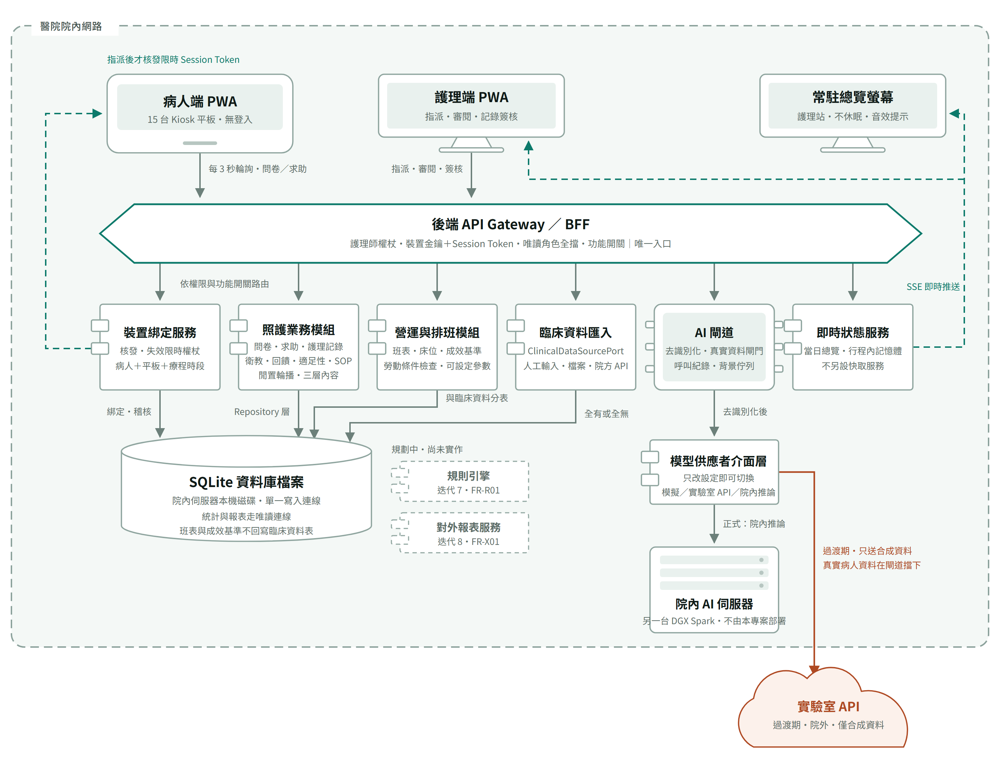
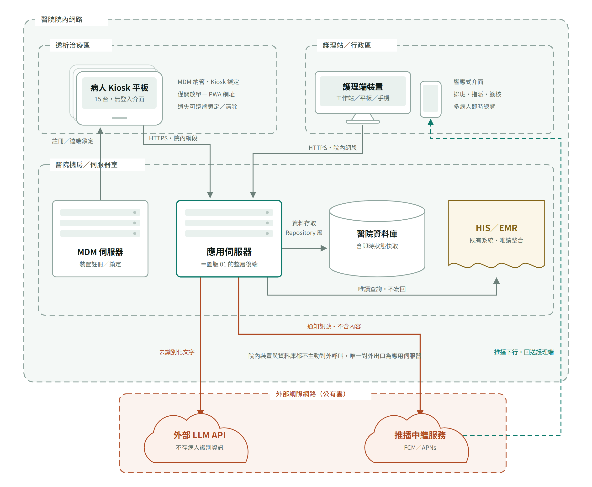

# 架構圖

兩張圖是系統實體與邏輯架構的視覺依據，與 [實作規格書](implementation-spec.md) 搭配閱讀。
圖一畫軟體元件之間怎麼互相呼叫，圖二畫這些東西實際擺在哪裡、哪條線跨出醫院；
圖一的整層後端，就是圖二機房裡那一台應用伺服器。

**2026-09-19 更新，對應第一次正式部署前的需求改版。** 前兩次重繪（0911 依 SRS v2.0、0912 補迭代 6）
都只在既有骨架上換標籤；**這一次不同——圖二真的少了一台機器、少了一條線。** 與 0909 版的差異見文末。

這次動的四處：

| 動了什麼 | 圖上怎麼變 |
|---|---|
| 應用主機由 DGX Spark 改為**院內另一台 Windows 工作站**（仍與其他專案共用） | 應用伺服器的標籤改成「共用 Windows 工作站・離線安裝包」 |
| AI 推論退成**另一台機器上的端點** | 原本寫「同一台 DGX Spark」，現在寫「另一台 DGX Spark」，框名改為「院內 AI 推論端點」 |
| 平板管控**不走 MDM** | **機房裡的 MDM 那一格整個拿掉**，連同它到平板的「註冊／遠端鎖定」那條線；平板的說明改成「自包外殼・螢幕固定・免 MDM」 |
| 臨床數值來源**確定走院方 API** | HIS／EMR 的說明由「來源待 Q-09」改成「院方唯讀 API」 |

**「少了一台機器」與「多了一台機器」在這張圖上同時發生**：機房裡少了 MDM，但 AI 推論端點從
「應用伺服器的同一台」變成獨立的另一台。框的數量因此不變，意義卻完全不同——前者是本系統
不再需要的東西，後者是本系統不負責維運的東西。

會動到圖二的分區與連線的，就是這種硬體或管控路線真的變了的時候。

**兩張圖的「醫院院內網路」是同一個框**：病人端平板、護理端裝置與常駐總覽螢幕都在框內。

---

## 全端架構（含裝置綁定流程）



護理師指派平板 → 系統核發 Session Token（綁定「病人＋平板＋本次療程」）→ 平板在輪詢時領到 Token，在有效期間只能存取本次綁定的資料。
細節見 [SRS 4.3／4.4](srs.md) 與[技術進度報告 §5.2](../reports/progress-technical.md)。

**讀圖五個重點**

- 三個前端的實線箭頭都只指向 API Gateway，沒有任何一條線直達資料庫——這是[資料庫使用規範](database-policy.md) 第 2 條的圖像化。裝置綁定、照護業務、營運與排班、臨床資料匯入寫的是同一個 SQLite 檔案，寫入連線只有一條。
- 綠色虛線都是伺服器端送下來的：左邊那條是 Session Token，要等護理師指派後才核發，平板每 3 秒輪詢時領取；右邊那條是院內 SSE 長連線，把即時總覽推給護理端與常駐總覽螢幕。推播已整條移除（FR-S07）。
- 所有 AI 呼叫都先過 AI 閘道（去識別化、真實病人資料閘門、呼叫紀錄、背景佇列），再經模型供應者介面層；要用模擬、實驗室 API 還是院內推論，只改設定（FR-S06）。
- 鏽色線只剩一條：過渡期的實驗室 API，程式強制只送合成資料。虛線外框的規則引擎與對外報表服務是規劃中、尚未實作的元件（0919 重排後分別排在迭代 11 與 12）。
- **照護業務模組裡的「閒置輪播・三層內容」是迭代 6 新增的**：卡片一律由後端組好再送到平板，因此「輪播畫面不得出現姓名與病歷號」這條規則只在一處判定，不必寄望每一個畫面元件都記得它。第三層的臨床數值來自左邊臨床資料匯入寫進去的那幾張表，平板不另外開一條路去拿。
- **營運與排班模組（迭代 5）是本系統第一個蒐集「護理師自己的資料」的地方**：班表、床位分配、成效基準，以及求助結案時那些可設定的選項與參數。它與其他模組寫同一個檔案，但班表與成效基準自成資料表，**不回寫臨床資料表**——同一批資料，用途不同風險就不同，拿來排班是管理工具，拿來算個人績效是另一回事（[資料庫使用規範](database-policy.md) 第 11 條）。圖上那條標著「與臨床資料分表」的線，畫的就是這件事。

---

## 系統實體架構與網路分區



資料流一律為 **前端 → 後端 API → SQLite 檔案**；前端不含任何資料庫套件，
存取全數收斂在後端 Repository 層。約束見 [資料庫使用規範](database-policy.md)。

**讀圖五個重點**

- 虛線框是網段，不是資料夾；沒畫出來的線和畫出來的一樣重要——平板、護理端裝置、總覽螢幕、資料庫都沒有任何一條往外打的線。
- 主動跨出醫院的只有一條，起點是應用伺服器：過渡期的實驗室 API。院內 AI 推論端點就位、真實資料要進 AI 流程時，這條線就拿掉（[Q-07、Q-08](open-questions.md)）。
- **應用伺服器與 AI 推論端點是兩台不同的機器**（0919 起）：應用伺服器是院內一台與其他專案共用的 Windows 工作站，以離線安裝包部署；AI 推論端點在另一台 DGX Spark 上，不由本專案部署（《[部署規範](deployment-spec.md)》DEP-07、DEP-16）。**0916 以前這兩個框畫的是同一台機器的兩個服務**，現在它們真的是兩台。
- SQLite 檔案與應用伺服器在同一台機器的本機 SSD，不放網路磁碟，也不放在任何雲端同步資料夾底下（資料庫使用規範 7.2）；每日以線上備份寫到**院內另一台機器**，同機的第二顆 SSD 可以當第一落點但不能是唯一落點（8.1、DEP-06）。
- 常駐總覽螢幕是部署必要條件，不是選配：推播拿掉之後，它是唯一保證通報被看見的地方（FR-N12，位置與硬體待 Q-10）。
- HIS／EMR 用另一種顏色與形狀，因為它不是本專案的系統，只讀、不寫回；臨床數值經臨床資料匯入進來，**0919 確定走院方唯讀 API**，欄位與認證細節待 Q-09。**圖上找不到 MDM 是刻意的**：平板改以自包 WebView 外殼加系統內建的螢幕固定管控，系統端只留佈建狀態的紀錄與逸出偵測，沒有任何裝置管理通道（見《[平板管控：免 MDM 的全院內方案](../notes/mdm-offline-plan.md)》）。

---

## 圖例

| 形狀 | 代表 |
|---|---|
| 平板外框 | 病人端裝置（Kiosk 平板，以自包 WebView 外殼載入，免 MDM） |
| 螢幕＋腳架 | 護理端裝置（工作站／平板／手機）與常駐總覽螢幕 |
| 六邊形 | API Gateway／BFF，唯一入口 |
| 左側雙耳矩形 | 後端服務元件（裝置綁定、照護業務、營運與排班、臨床資料匯入、即時狀態、模型供應者介面層） |
| 晶片 | AI 閘道 |
| 圓柱 | SQLite 資料庫檔案與備份目的地 |
| 機櫃 | 實體主機（應用伺服器為共用的 Windows 工作站；AI 推論端點為另一台機器） |
| 雲 | 院外服務（只剩過渡期的實驗室 API） |
| 波浪底文件 | 既有系統，唯讀整合 |
| 虛線外框矩形 | 規劃中、尚未實作的元件 |

| 線條 | 代表 |
|---|---|
| 實線箭頭 | 請求／資料寫入，由前端或上游發起 |
| 綠色虛線 | 伺服器端送下來：SSE 推送、指派後才核發的 Session Token |
| 鏽色實線 | 跨出醫院邊界：只剩過渡期的實驗室 API，只送合成資料 |

| 框線 | 代表 |
|---|---|
| 灰綠虛線框 | 網段。最外層是醫院院內網路，內層是治療區、護理站、機房 |
| 鏽色虛線框 | 外部網際網路，框內是過渡期才用的院外服務 |

---

## 四句必背

1. 資料流方向恆定：前端 → 後端 API → SQLite 檔案。前端不碰資料庫檔案，後端是唯一的寫入者，統計與報表走唯讀連線。
2. 身分不靠登入靠綁定：Session Token ＝ 病人＋平板＋療程時段，限時限裝置，由自建服務核發與失效。
3. 院內裝置與資料庫一條對外連線都沒有。唯一跨出醫院的是過渡期的實驗室 API，AI 閘道在程式裡強制只送合成資料。
4. 病人的資料與護理師的資料分表存放：營運與排班模組寫的是班表與成效基準，兩邊永遠不互相回寫。

---

## 與 0909 版的差異

| 0909 版 | 0911 重繪 |
|---|---|
| 推播通知服務＋推播中繼（FCM／APNs），由院外回送護理端 | 整條拿掉。院內 SSE 長連線推給護理端，護理站加一台常駐總覽螢幕 |
| AI Proxy 呼叫外部 LLM API | AI 閘道＋背景佇列 → 模型供應者介面層 → 院內 AI 伺服器；過渡期的實驗室 API 只送合成資料 |
| 醫院資料庫（PostgreSQL）＋即時狀態快取 | 一個 SQLite 檔案，放在應用伺服器本機磁碟；即時狀態放在後端行程記憶體，不另設快取服務 |
| — | 新增臨床資料匯入、照護業務模組、備份目的地；規則引擎與對外報表服務以虛線標為規劃中 |
| — | **迭代 5 再加一個營運與排班模組**（班表、床位、成效基準、可設定參數），並在資料庫那格註明「班表與成效基準不回寫臨床資料表」 |
| — | **迭代 6 在照護業務模組補上「閒置輪播・三層內容」**；兩張圖的正式主機標上 DGX Spark，應用伺服器標上 `linux/arm64` 容器部署。沒有新增機器或連線 |
| — | **0919 第一次動到圖二的分區與線**：應用伺服器改為院內另一台 Windows 工作站（仍與其他專案共用，離線安裝包），AI 推論端點退成另一台機器，**MDM 整格與那條「註冊／遠端鎖定」的線一起拿掉**，臨床數值來源改標為院方唯讀 API |

---

兩張圖的原始碼在 [`architecture-diagrams.src.html`](architecture-diagrams.src.html)。
改圖請改這份，再用它重新產生 `images/` 底下的 PNG（本機 Chrome 無頭模式、淺色主題、2 倍解析度），不要單獨修圖片。
那份 HTML 本身就是可縮放、深淺主題自動切換的版本，用瀏覽器直接開即可，文件站上也點得開。

**PNG 換掉之後就沒有別的事了**：文件站上的圖走的就是 repo 裡的這兩個檔案，同步過去即是新圖。

> 2026-09-17 文件站由 HackMD 換成 GitHub Pages 之後，圖片改走 repo 相對路徑。
> 原本「圖改了要另外上傳、換掉對應表裡的網址，否則鏡像還是舊圖」那一步已經不存在。

**重新產生 PNG 的實際指令**（Windows，Chrome 已安裝）：把 `architecture-diagrams.src.html` 裡的
單一 `<svg>` 連同 `<style>` 包成一頁，在 `<html>` 上加 `data-theme="light"`（否則跟著系統偏好
變成深色），再以無頭模式截圖。視窗尺寸取該圖 `viewBox` 的寬高，`--force-device-scale-factor=2`
產出的就是既有 PNG 的尺寸（圖一 2800×2120、圖二 2480×2000）：

```
chrome --headless=new --disable-gpu --hide-scrollbars \
  --user-data-dir=<另開一個暫存目錄> --force-device-scale-factor=2 \
  --virtual-time-budget=20000 --window-size=1400,1060 \
  --screenshot=<輸出.png> file:///<單張圖的 html>
```

`--user-data-dir` 不能省：Chrome 正在開著時，共用同一個設定檔會啟動失敗。

> **2026-09-19 實際跑過一次，補兩個坑**：
>
> 1. **兩張圖要分成兩次呼叫，而且各給一個不同的 `--user-data-dir`。** 連在同一行裡跑，第二張圖會安靜地沒有輸出——不出錯、不留檔案，很容易以為是圖壞了
> 2. 組出來的暫存 HTML 放在暫存目錄即可，**不要放進 repo**。它是產物，`src.html` 才是真本

---

## 版本歷程

| 定版 | 日期 | 異動 |
|---|---|---|
| 0923 | 2026-09-23 | 依 0919 改版重繪：應用伺服器改為共用 Windows 工作站（離線安裝包），AI 推論退成另一台機器，機房裡的 MDM 整格與其連線拿掉，臨床數值確定走院方唯讀 API；補上產圖時的兩個坑 |
| [0916](https://94sh09sh19sh.github.io/hd-docs/0916/requirements/architecture-diagrams/) | 2026-09-16 | 兩張圖依 v2.0 重繪並更新到迭代 6：拿掉推播中繼與外部 LLM，改畫 SQLite、SSE、院內 AI 伺服器、營運與排班模組、閒置輪播三層；圖二未動——班表與輪播沒有新增任何機器或網路連線 |
| [0909](https://94sh09sh19sh.github.io/hd-docs/0909/requirements/architecture-diagrams/) | 2026-09-09 | 首次定版 |

[← 回進度首頁](../index.md)
