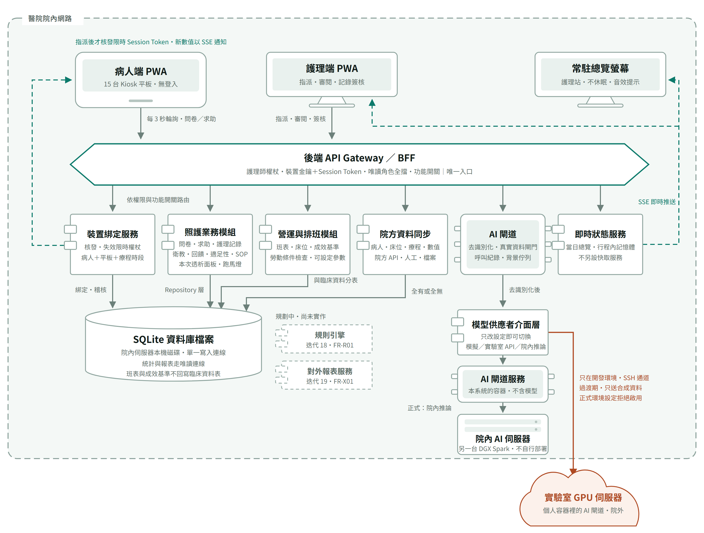
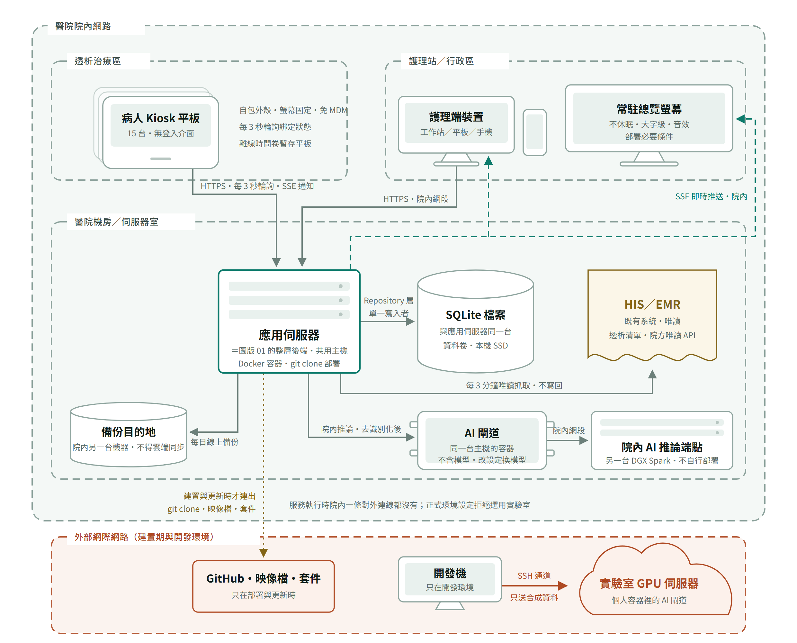

# 架構圖

兩張圖是系統實體與邏輯架構的視覺依據，與 [實作規格書](implementation-spec.md) 搭配閱讀。
圖一畫軟體元件之間怎麼互相呼叫，圖二畫這些東西實際擺在哪裡、哪條線跨出醫院；
圖一的整層後端，就是圖二機房裡那一台應用伺服器。

**2026-09-29 更新，依 0926 改版重繪，對應迭代 14.3 完成時的系統。** 這是第二次動到圖二的線（第一次是 0919）。
**1005 迭代 16 只改圖一的三處文字**：照護業務模組裡的「閒置輪播・三層內容」改成「本次透析面板・跑馬燈」，虛線框的規則引擎與對外報表服務標成迭代 18、19。
**1005 再補迭代 15，兩張圖都只改標籤**：圖一的「臨床資料匯入」改稱**院方資料同步**（病人・床位・療程・數值），Session Token 那條綠色虛線補上「新數值以 SSE 通知」；
圖二的 HIS／EMR 改標「透析清單・院方唯讀 API」、它的連線改標「每 3 分鐘唯讀抓取・不寫回」，平板的連線補上 SSE 通知。**分區與連線一條未動**，現在對應迭代 17 完成時的系統（迭代 17 的跑馬燈草稿走既有的 AI 閘道，圖上不必改）。
**1010 迭代 18 只改圖一的一格**：規則引擎做完了，從虛線框（規劃中）改成實線，副標改成「判斷輔助・不經 AI」；~~對外報表服務仍是虛線（迭代 19）~~。規則引擎是後端裡的一個模組，寫同一個 SQLite 檔案、讀歷史資料走唯讀連線，**不呼叫 AI 閘道**，所以**分區與連線一條未動**，圖二不必改。
**1010 迭代 19 再改圖一的一格**：對外報表服務做完了，從虛線改成實線，副標改成「只出聚合值・核准後取出」；圖上已經沒有「規劃中」的元件，圖例那一格拿掉。它也是後端裡的一個模組、寫同一個 SQLite 檔案，取出的檔案由護理站電腦下載，**分區與連線一條未動**，圖二不必改。管理儀表板與獎勵制度是營運與排班那一格的延伸（讀既有紀錄算數字、不回寫臨床資料表），格子不變。
**1010 迭代 20 兩張圖都不必改**：遊戲化之一（完成記號、我的衛教小本子、病友小撇步、跑馬燈的「你知道嗎」、護理師的回覆）是病人端與後端既有模組裡的功能，寫同一個 SQLite 檔案；「你知道嗎」由 AI 生成，走原本那條經 AI 閘道的線。**沒有新元件、沒有新連線**。
**1010 迭代 21 兩張圖也都不必改**：透析小花園、送花、共同花園是後端裡多一個模組（`modules/garden`）、寫同一個 SQLite 檔案；平板斷線時先存本機再補送，用的是症狀回報原本那一套本機佇列；送花推給總覽螢幕的花瓶，走原本那條院內 SSE；植物插畫是程式產生的向量圖、隨程式一起進離線快取，**不從任何地方下載**。沒有新元件、沒有新連線。
**1011 迭代 22 兩張圖也都不必改**：麻將連連看是後端裡多一個模組（`modules/mahjong`）、病人詳細資訊是另一個（`modules/patient-detail`），寫同一個 SQLite 檔案；平板斷線時用同一套本機佇列；牌面是放進病人端的圖檔、隨程式一起進離線快取，**執行期不從任何地方下載**；狀態評估彙整是後端的固定算式，不經 AI 閘道。社工、醫師是護理端的兩種帳號，不是新元件。沒有新元件、沒有新連線。現在對應迭代 22 完成時的系統。
依據見《[部署規範](deployment-spec.md)》v3.0 第 1、3、5 章。

這次動的四處：

| 動了什麼 | 圖上怎麼變 |
|---|---|
| 部署改為 **Docker 容器＋`git clone`**，離線安裝包撤除 | 應用伺服器的標籤改成「Docker 容器・git clone 部署」；資料庫改標「資料卷・本機 SSD」 |
| 後端不再直接連推論端點，一律經**本系統的 AI 閘道**（迭代 13，Python ＋ LangChain 的容器，不含模型） | 圖一在模型供應者介面層與院內 AI 伺服器之間多一格「AI 閘道服務」；圖二在應用伺服器與 AI 推論端點之間多一格「AI 閘道」（同一台主機上的容器） |
| 過渡期的實驗室改為**只在開發環境**，由開發機經 SSH 通道連到實驗室個人容器裡的 AI 閘道；正式環境設定下選用它直接拒絕啟動（DEP-40） | 圖二**拿掉院內主機連到實驗室的那條線**，改畫在外部網路框裡：開發機 → SSH 通道 → 實驗室 GPU 伺服器。圖一的鏽色線保留，標明只在開發環境 |
| 院內主機在部署與更新時要連出取得程式碼、映像檔與套件 | 圖二多一條**赭色點線**（建置期才有），與執行期零連外分開畫 |

**圖二因此第一次做到「服務執行時一條跨出醫院的線都沒有」**：0919 版還有一條從應用伺服器連到實驗室的鏽色線，現在它只存在於開發環境。
建置期那條線是新的，但它只在有人下 `git clone`、`docker compose build` 的那段時間存在。0930 確認主機對外連線是常態、沒有限制（Q-32）。

0919 那次重繪的四處（應用主機改為共用 Windows 工作站、AI 推論退成另一台機器、MDM 整格拿掉、臨床數值走院方唯讀 API）仍然成立，見文末。

**兩張圖的「醫院院內網路」是同一個框**：病人端平板、護理端裝置與常駐總覽螢幕都在框內。

---

## 全端架構（含裝置綁定流程）



護理師指派平板 → 系統核發 Session Token（綁定「病人＋平板＋本次療程」）→ 平板在輪詢時領到 Token，在有效期間只能存取本次綁定的資料。
細節見 [SRS 4.3／4.4](srs.md) 與[技術進度報告 §5.2](../reports/progress-technical.md)。

**讀圖五個重點**

- 三個前端的實線箭頭都只指向 API Gateway，沒有任何一條線直達資料庫——這是[資料庫使用規範](database-policy.md) 第 2 條的圖像化。裝置綁定、照護業務、營運與排班、臨床資料匯入寫的是同一個 SQLite 檔案，寫入連線只有一條。
- 綠色虛線都是伺服器端送下來的：左邊那條是 Session Token，要等護理師（或 1005 起的院方資料同步）指派後才核發，平板每 3 秒輪詢時領取；**1005 迭代 15 起平板另以院內 SSE 收到「有新數值」的通知**（事件不帶數值，平板收到後自己重取）。右邊那條是院內 SSE 長連線，把即時總覽推給護理端與常駐總覽螢幕。推播已整條移除（FR-S07）。
- 所有 AI 呼叫都先過 AI 閘道（去識別化、真實病人資料閘門、呼叫紀錄、背景佇列），再經模型供應者介面層；要用模擬、實驗室 API 還是院內推論，只改設定（FR-S06）。
- **0927 起模型供應者介面層下面多一格 AI 閘道服務**：本系統自己的容器，不含模型，只負責把請求轉給推論端點；換模型只改它的 `config.yaml`，後端不動（FR-S13、DEP-41）。上面那格「AI 閘道」是後端裡的把關（去識別化、真實資料閘門、呼叫紀錄），兩者不是同一個東西。
- 鏽色線只剩一條：過渡期的實驗室 GPU 伺服器，**只在開發環境經 SSH 通道使用**，程式強制只送合成資料，正式環境設定下選用它直接拒絕啟動。~~虛線外框的對外報表服務是規劃中、尚未實作的元件（迭代 19）。~~ 對外報表服務 1010 迭代 19 已實作，改畫實線。**規則引擎 1010 迭代 18 已實作**，改畫實線：風險分層提示、療程中預警、劑量調整參考與透析適足性趨勢推估都由它照規則版本比對，整條路上不呼叫模型（SRS FR-R01），所以它與 AI 閘道之間沒有線。
- **照護業務模組裡的「本次透析面板・跑馬燈」是 1005 迭代 16 改的**（取代迭代 6 的「閒置輪播・三層內容」）：面板與跑馬燈一律由後端組好再送到平板，只送畫面要用的欄位，因此「畫面不得出現姓名與病歷號」這條規則只在一處判定，不必寄望每一個畫面元件都記得它。面板的血壓、脫水量與體重來自左邊院方資料同步寫進去的那幾張表，平板不另外開一條路去拿。
- **院方資料同步（1005 迭代 15，原「臨床資料匯入」）**：每 3 分鐘唯讀抓取院方透析清單 API，病人、床位、療程開始與下機由它自動完成；它**不另開寫入路徑**，走的是護理師操作時同一支服務，稽核操作者記為「院方資料同步」。人工輸入與 Excel／CSV 匯入只留在專業版當備援。開發與模擬部署用的模擬院方 API 不在圖上——正式環境設定下指向它，後端拒絕啟動。
- **營運與排班模組（迭代 5）是本系統第一個蒐集「護理師自己的資料」的地方**：班表、床位分配、成效基準，以及求助結案時那些可設定的選項與參數。它與其他模組寫同一個檔案，但班表與成效基準自成資料表，**不回寫臨床資料表**——同一批資料，用途不同風險就不同，拿來排班是管理工具，拿來算個人績效是另一回事（[資料庫使用規範](database-policy.md) 第 11 條）。圖上那條標著「與臨床資料分表」的線，畫的就是這件事。

---

## 系統實體架構與網路分區



資料流一律為 **前端 → 後端 API → SQLite 檔案**；前端不含任何資料庫套件，
存取全數收斂在後端 Repository 層。約束見 [資料庫使用規範](database-policy.md)。

**讀圖五個重點**

- 虛線框是網段，不是資料夾；沒畫出來的線和畫出來的一樣重要——平板、護理端裝置、總覽螢幕、資料庫都沒有任何一條往外打的線。
- **服務執行時沒有任何一條線跨出醫院。** 唯一從院內主機往外的是赭色點線：部署與更新時 `git clone`、建置映像檔、下載套件，服務起來之後不用（DEP-39；0930 確認對外連線是常態、沒有限制，[Q-32](open-questions.md)）。這句講的是本系統；主機上 Docker Desktop 自己的使用統計目前開著，那條線不經過本系統，~~能不能關待 [Q-27](open-questions.md) 第 9 題~~ **1007 答覆第三次進院關掉**（[Q-27](open-questions.md) 第 9 題、《部署規範》DEP-14），關掉之後這句不必加例外。
- 過渡期的實驗室 GPU 伺服器**不再從院內主機連出**：它只在開發環境由開發機經 SSH 通道使用（DEP-42），院內正式環境設定下選用它會拒絕啟動（DEP-40）。院內 AI 推論端點就位之後，AI 一律走院內（[Q-07](open-questions.md)）。
- **應用伺服器與 AI 推論端點是兩台不同的機器**（0919 起）：應用伺服器是院內一台與其他專案共用的 Windows 工作站，0926 起以 Docker 容器＋`git clone` 部署，本系統的 AI 閘道是同一台主機上的另一個容器；AI 推論端點在另一台 DGX Spark 上，不由本專案部署（《[部署規範](deployment-spec.md)》DEP-07、DEP-16）。**0916 以前這兩個框畫的是同一台機器的兩個服務**，現在它們真的是兩台。
- SQLite 檔案與應用伺服器在同一台機器的本機 SSD（0926 起放在固定名稱的 Docker 資料卷裡，拆容器不會動到它），不放網路磁碟，也不放在任何雲端同步資料夾底下（資料庫使用規範 7.2）；每日以線上備份寫到**院內另一台機器**，同機的第二顆 SSD 可以當第一落點但不能是唯一落點（8.1、DEP-06）。
- 常駐總覽螢幕是部署必要條件，不是選配：推播拿掉之後，它是唯一保證通報被看見的地方（FR-N12，位置與硬體待 Q-10）。
- HIS／EMR 用另一種顏色與形狀，因為它不是本專案的系統，只讀、不寫回；臨床數值經臨床資料匯入進來，**0919 確定走院方唯讀 API**；**1005 起它是病人、床位與療程的日常來源**（院方透析清單 API，每 3 分鐘唯讀抓取、不寫回），實際的回應結構待第三次進院探測（Q-09 第 9 題），本系統的使用報備待 Q-35。**圖上找不到 MDM 是刻意的**：平板改以自包 WebView 外殼加系統內建的螢幕固定管控，系統端只留佈建狀態的紀錄與逸出偵測，沒有任何裝置管理通道（見《[平板管控：免 MDM 的全院內方案](../notes/mdm-offline-plan.md)》）。

---

## 圖例

| 形狀 | 代表 |
|---|---|
| 平板外框 | 病人端裝置（Kiosk 平板，以自包 WebView 外殼載入，免 MDM） |
| 螢幕＋腳架 | 護理端裝置（工作站／平板／手機）與常駐總覽螢幕 |
| 六邊形 | API Gateway／BFF，唯一入口 |
| 左側雙耳矩形 | 後端服務元件（裝置綁定、照護業務、營運與排班、院方資料同步、即時狀態、模型供應者介面層） |
| 晶片 | AI 閘道（後端裡的把關；0927 起另有本系統的 AI 閘道服務容器，同一種形狀） |
| 圓柱 | SQLite 資料庫檔案與備份目的地 |
| 機櫃 | 實體主機（應用伺服器為共用的 Windows 工作站；AI 推論端點為另一台機器） |
| 雲 | 院外服務（只剩過渡期、只在開發環境使用的實驗室 GPU 伺服器） |
| 波浪底文件 | 既有系統，唯讀整合 |
| 虛線外框矩形 | 規劃中、尚未實作的元件 |

| 線條 | 代表 |
|---|---|
| 實線箭頭 | 請求／資料寫入，由前端或上游發起 |
| 綠色虛線 | 伺服器端送下來：SSE 推送、指派後才核發的 Session Token |
| 鏽色實線 | 跨出醫院邊界的執行期呼叫：只剩開發環境的實驗室 GPU 伺服器，只送合成資料 |
| 赭色點線 | 建置期才有的連出（`git clone`、映像檔、套件），服務執行時不用 |

| 框線 | 代表 |
|---|---|
| 灰綠虛線框 | 網段。最外層是醫院院內網路，內層是治療區、護理站、機房 |
| 鏽色虛線框 | 外部網際網路，框內是建置期的來源與只在開發環境使用的院外服務 |

---

## 四句必背

1. 資料流方向恆定：前端 → 後端 API → SQLite 檔案。前端不碰資料庫檔案，後端是唯一的寫入者，統計與報表走唯讀連線。
2. 身分不靠登入靠綁定：Session Token ＝ 病人＋平板＋療程時段，限時限裝置，由自建服務核發與失效。
3. 服務執行時，院內裝置與資料庫一條對外連線都沒有；院內主機只在部署與更新時連出（建置期）。過渡期的實驗室只在開發環境經 SSH 通道使用，AI 呼叫在程式裡強制只送合成資料，正式環境設定下選用它會直接拒絕啟動。
4. 病人的資料與護理師的資料分表存放：營運與排班模組寫的是班表與成效基準，兩邊永遠不互相回寫。

---

## 與 0909 版的差異

| 0909 版 | 0911 重繪 |
|---|---|
| 推播通知服務＋推播中繼（FCM／APNs），由院外回送護理端 | 整條拿掉。院內 SSE 長連線推給護理端，護理站加一台常駐總覽螢幕 |
| AI Proxy 呼叫外部 LLM API | AI 閘道＋背景佇列 → 模型供應者介面層 → 院內 AI 伺服器；過渡期的實驗室 API 只送合成資料 |
| 醫院資料庫（PostgreSQL）＋即時狀態快取 | 一個 SQLite 檔案，放在應用伺服器本機磁碟；即時狀態放在後端行程記憶體，不另設快取服務 |
| — | 新增臨床資料匯入、照護業務模組、備份目的地；規則引擎與對外報表服務以虛線標為規劃中 |
| — | **迭代 5 再加一個營運與排班模組**（班表、床位、成效基準、可設定參數），並在資料庫那格註明「班表與成效基準不回寫臨床資料表」 |
| — | **迭代 6 在照護業務模組補上「閒置輪播・三層內容」**；兩張圖的正式主機標上 DGX Spark，應用伺服器標上 `linux/arm64` 容器部署。沒有新增機器或連線 |
| — | **0919 第一次動到圖二的分區與線**：應用伺服器改為院內另一台 Windows 工作站（仍與其他專案共用，離線安裝包），AI 推論端點退成另一台機器，**MDM 整格與那條「註冊／遠端鎖定」的線一起拿掉**，臨床數值來源改標為院方唯讀 API |
| — | **0926 第二次動到圖二的線**：部署改為 Docker 容器＋`git clone`；後端與推論端點之間多一格本系統的 AI 閘道（容器，不含模型）；院內主機連到實驗室的線拿掉，改為只在開發環境由開發機經 SSH 通道連線；建置期的連出另畫一條赭色點線 |
| — | **1005 迭代 15 只改標籤**：「臨床資料匯入」改稱院方資料同步；平板多一條院內 SSE 通知、HIS／EMR 改標透析清單與每 3 分鐘唯讀抓取。分區與連線不變 |

---

兩張圖的原始碼在 [`architecture-diagrams.src.html`](architecture-diagrams.src.html)。
改圖請改這份，再用它重新產生 `images/` 底下的 PNG（本機 Chrome 無頭模式、淺色主題、2 倍解析度），不要單獨修圖片。
那份 HTML 本身就是可縮放、深淺主題自動切換的版本，用瀏覽器直接開即可，文件站上也點得開。

**PNG 換掉之後就沒有別的事了**：文件站上的圖走的就是 repo 裡的這兩個檔案，同步過去即是新圖。

> 2026-09-17 文件站由 HackMD 換成 GitHub Pages 之後，圖片改走 repo 相對路徑。
> 原本「圖改了要另外上傳、換掉對應表裡的網址，否則鏡像還是舊圖」那一步已經不存在。

**重新產生 PNG 的實際指令**（Windows，Chrome 已安裝）：把 `architecture-diagrams.src.html` 裡的
單一 `<svg>` 連同 `<style>` 包成一頁，在 `<html>` 上加 `data-theme="light"`（否則跟著系統偏好
變成深色），再以無頭模式截圖。視窗尺寸取該圖 `viewBox` 的寬高，`--force-device-scale-factor=2`
產出的就是既有 PNG 的尺寸（圖一 2800×2120、圖二 2480×2000）：

```
chrome --headless=new --disable-gpu --hide-scrollbars \
  --user-data-dir=<另開一個暫存目錄> --force-device-scale-factor=2 \
  --virtual-time-budget=20000 --window-size=1400,1060 \
  --screenshot=<輸出.png> file:///<單張圖的 html>
```

`--user-data-dir` 不能省：Chrome 正在開著時，共用同一個設定檔會啟動失敗。

> **2026-09-19 實際跑過一次，補兩個坑**：
>
> 1. **兩張圖要分成兩次呼叫，而且各給一個不同的 `--user-data-dir`。** 連在同一行裡跑，第二張圖會安靜地沒有輸出——不出錯、不留檔案，很容易以為是圖壞了
> 2. 組出來的暫存 HTML 放在暫存目錄即可，**不要放進 repo**。它是產物，`src.html` 才是真本
>
> **2026-09-29 再補一個**：
>
> 3. **在 Git Bash 裡直接呼叫 `chrome.exe` 會安靜地沒有輸出**（指令馬上結束、不出錯、沒有 PNG）。改在 PowerShell 用 `Start-Process -FilePath <chrome.exe> -ArgumentList @(...) -Wait`，`--screenshot` 與 `--user-data-dir` 寫 Windows 路徑，`file:///` 後面接正斜線的路徑。兩張圖仍各用一個不同的 `--user-data-dir`

---

## 版本歷程

| 定版 | 日期 | 異動 |
|---|---|---|
| [1007](https://94sh09sh19sh.github.io/hd-docs/1007/requirements/architecture-diagrams/) | 2026-10-07 | 1005 迭代 15、16 兩張圖只改標籤：「臨床資料匯入」改稱院方資料同步、HIS／EMR 改標透析清單院方唯讀 API、閒置輪播改為本次透析面板與跑馬燈，平板多一條院內即時通知；分區與連線不變 |
| [0930](https://94sh09sh19sh.github.io/hd-docs/0930/requirements/architecture-diagrams/) | 2026-09-30 | 兩張圖依 0926 改版重繪：容器部署、外殼 App 在另一個 repo、AI 閘道；補上 Git Bash 裡 Chrome 無頭模式沒有輸出的坑；Q-27、Q-32 的 0930 答覆 |
| [0923](https://94sh09sh19sh.github.io/hd-docs/0923/requirements/architecture-diagrams/) | 2026-09-23 | 依 0919 改版重繪：應用伺服器改為共用 Windows 工作站（離線安裝包），AI 推論退成另一台機器，機房裡的 MDM 整格與其連線拿掉，臨床數值確定走院方唯讀 API；補上產圖時的兩個坑 |
| [0916](https://94sh09sh19sh.github.io/hd-docs/0916/requirements/architecture-diagrams/) | 2026-09-16 | 兩張圖依 v2.0 重繪並更新到迭代 6：拿掉推播中繼與外部 LLM，改畫 SQLite、SSE、院內 AI 伺服器、營運與排班模組、閒置輪播三層；圖二未動——班表與輪播沒有新增任何機器或網路連線 |
| [0909](https://94sh09sh19sh.github.io/hd-docs/0909/requirements/architecture-diagrams/) | 2026-09-09 | 首次定版 |

[← 回進度首頁](../index.md)
