# 1007 週報 — 第二次進院部分成功，院方 API 取代手動輸入（迭代 15～17）

**期間**：2026-09-30 ～ 2026-10-07
**對應 commit**：`9992721` → `6c09381`（程式到迭代 17：`6c09381`；定版前會再補）
**狀態**：進行中（2026-10-05 週中草稿，1006 補迭代 17.1，1007 補迭代 17.2～17.6，1007 定版時收尾）

---

## 本週進度

- **1001 第二次進院：B 級部分成功**。照第十四冊做到最後一步，三個服務在院內主機上起來、外殼 APK 建好、金鑰備份核對通過；**護理端按下登入出現 `Failed to fetch`，離院前沒有解開**（後端不放行護理端的來源）。備份還原、重新開機與平板都還沒做
- **回來之後把部署手冊改寫成第十五冊**（新手版第二版）與兩本 `.env` 子手冊，另寫第十五冊之三（1001 為什麼登不進去，白話版）、之四（主機位址從名稱改成 IP）
- **1004 讀了同院 IDH 系統的程式**，整理成《[同院 IDH 系統參考調查](../notes/idh-reference-survey.md)》；**1005 使用者逐項決定**：直接用院方那支透析清單 API、數值名稱改用 API 的稱呼、抽血數值暫定拿不到（相關功能預設關閉）、低血壓門檻與處置直接套用、床號不設上限、主機位址改用 IP
- **1005 新版需求，同日完成迭代 15～17**：院方 API 判斷得出來的事不再要護理師做（迭代 15）；病人平板中間那一區由輪播改成「本次透析」——血壓與脫水量的折線圖加一條跑馬燈（迭代 16）；**跑馬燈內容由 AI 寫、護理師只核准**（迭代 17）。SRS 需求 70 → 73 條，原迭代 15、16 再順延為 18、19
- **1006 迭代 17.1**：簡易版**把病人拖到平板**就配好、平板自己跑到院方資料的那一床（每次透析配，原本「每位病人配一次、之後自動接上」拿掉）；「鎖定」一律叫「停用」、移到系統管理、正在透析的停用不了；護理端改名「公告與院內衛教」「結束與離院衛教」（離院衛教併進同一頁）；**`npm run demo:patient` 不必進院就看得到病人平板透析到一半的樣子**
- **1007 迭代 17.2**：簡易版**中間改成平板**，把病人拖上去就配好、右上角自動出現床號；右邊只剩病人與公告與院內衛教；病人框多一顆**重新整理**，正在透析的排最上面（越晚開始越上面），其餘依姓名筆畫
- **1007 迭代 17.3**：系統裡**所有 AI 生成的內容禁用簡體字與中國大陸用語**。AI 閘道統一把關，照 Claude Code 的方式——查到就告訴模型哪個詞改成什麼、請它重寫，最後一次仍不合格也照樣交出，畫面上任何時候都看不出這道把關；詞庫另做一份醫療用的
- **1007 迭代 17.4**：病人平板**加回病人姓名與現在時間**——床號旁邊是姓名、最右邊是時間；病歷號仍不上首頁，面板與跑馬燈仍沒有姓名。截圖放在[附錄](#附錄截圖)
- **1007 迭代 17.5**：**透析一律開始後四小時結束**（院方硬性規定），不管院方資料有沒有預計結束時間——病人平板、簡易版、專業版即時總覽與總覽螢幕的進度全部一樣長，「待確認下機」也照這一條；原本護理端剛配上平板的病人透析了一個多小時，進度條還幾乎是空的。附錄的圖在 17.5 之後重截
- **1007 迭代 17.6**：簡易版公告與院內衛教的**草稿換得到後面幾則**（原本只放得出第一則）；專業版**拿掉「病人」那一頁**（病人一律由院方 API 建立），「裝置管理」改名「**新增裝置**」只管註冊新平板、底下照樣列出所有平板，「目前有效綁定」拿掉、解除佈建移到系統管理與停用同一處；排班與指派的病人下拉選單與簡易版病人框**同一個順序**，旁邊有重新整理。截圖補在[附錄](#附錄截圖)
- **1007 待決事項有了答案**：院內主機的 **IP 是固定的**（Q-27 第 12 題，第三次進院照換）；斷電後出現警示由**護理長重新登入**；Docker Desktop 的使用統計**第三次進院關閉**、市集自動更新先不改；**所有護理師都可以核准跑馬燈內容**（Q-28）；院方資料沒有預計結束時間時**一律以四小時計**（院方硬性規定）。另新增 Q-36：衛教要不要維持三種；Q-37：護理師的護理紀錄現在是什麼形式、系統的記錄如何接上現有作業
- 「我要找…」八份文件對到迭代 17（1007 再對到 17.6）：兩份進度報告改寫、架構圖補上院方資料同步與平板的即時推送、技術棧說明與測試手冊同步（API 附錄補齊迭代 10 之後的端點）；外殼契約的規則這週沒有變動（1007 只改了護理端註冊平板那一頁的名稱）
- **首頁的「其他文件」收進一份總表**：首頁只剩一行連結，十四份文件（1007 迭代 17.4 後十五份）在《[其他文件](../notes/index.md)》裡分成一般文件與小迭代文件

## 完成內容

### 1001：第二次進院，B 級部分成功

完整紀錄在部署手冊《[第十四冊之四](../deployment/14d-second-visit.md)》。和 0922 比，這次做對了最重要的一件事：**沒有自己開任何容器**，所有容器都由 `docker compose` 產生。

| 段落 | 結果 |
|---|---|
| 主機這一層（Git、防毒、目錄） | 通過。主機原本沒有 Git，現場裝了；Defender 的排除清單是空的，**未處理** |
| 程式碼、設定、建置、啟動 | 三個服務起來了；Docker 三次查不到 Docker Hub 的網域，重跑就過，這一步花了約半小時 |
| **護理端登入** | **`Failed to fetch`，未解**。後端活著，但帶 `Origin` 查放行標頭印出空的——後端的放行名單裡沒有護理端的來源 |
| 外殼 App | APK 建好、金鑰備份核對通過、病人端改走 HTTPS |
| 備份與重新開機、平板、冒煙測試 | **沒做**（登入不過，不能往下） |

**B 級的意思是**：服務留在主機上跑著，但不能交給護理師用。

### 部署手冊第十五冊與之一～之四（1001～1005）

| 冊 | 內容 |
|---|---|
| 十五 | 依 1001 帶回的資料重寫第十四冊（`V-xx`）：多一步 V-08「決定主機位址」、V-06 先下載兩個基底映像、V-17 登入失敗分四段查、防毒查法併入 V-05；院內現場資料以「📍 1001」方框標在步驟裡 |
| 十五之一、之二 | 取代第十四冊之一、之二。實際部署的範例改用 `<主機>` 並檢查有沒有照抄；模擬部署三個位址改用區網 IP，**讓登入問題在模擬部署就練得到** |
| 十五之三 | 1001 為什麼登不進去，寫給新手看：按下登入時瀏覽器先問後端收不收、來源要一字不差、`.env` 兩個變數各在什麼時候生效；下一次的 `E-01`～`E-16` |
| 十五之四 | 院內主機的位址從名稱改成 IP 的步驟（`T-01`～`T-14`）：平板一台都還沒佈建，現在換代價最小；**前提是資訊室把 IP 固定下來** |

1001 當天另推了四筆手冊修正：`JWT_SECRET` 改用 PowerShell 產生（不必先從 Docker Hub 下載映像檔）、查防毒排除清單的附錄、三處讓人以為出錯的正常輸出、登入失敗的分流附錄。

### 1004～1005：同院 IDH 系統參考調查與使用者的決定

院內同一處已部署另一個團隊的透析中低血壓預警系統，它每幾分鐘就向院方的透析清單 API 抓一次資料。讀完它的程式，整理出院方 API 的用法與 51 欄順序（**沒有任何抽血數值**）、41 床的床位配置、低血壓門檻與處置選擇。**院內位址、參考 repo 的網址與任何真實資料一律不寫進文件。**

1005 使用者回應了調查列出的十二件事：

| 決定 | 影響 |
|---|---|
| 直接用那支透析清單 API；抓取預設每 3 分鐘，護理站可調 | Q-09 來源已定 |
| 數值名稱沿用 API 的稱呼（理想體重、目標脫水量、結束體重、實際脫水量）；讀到 0 不顯示 | 文件與程式一起改，代號不變 |
| **API 沒有的抽血數值暫定拿不到** | 新開關「需要抽血數值的功能」，**預設關閉**：透析適足性收進去 |
| 低血壓門檻套用同院系統的門檻；處置選擇併入事件範本 | 範本升為 `EVENT-TEMPLATES-v2` |
| 床號照醫院編號、不寫死、不設上限；平板跟著病人 | 原本的 40 床上限拿掉 |
| 主機位址改用 IP | 第十五冊之四；Q-27 第 12 題剩「IP 能不能固定」（**1007 已答：固定**） |

### 1005 新版需求：院方 API 全面取代手動輸入

**判準：能用院方 API 判斷的，就不要求護理師操作。** SRS 新增 FR-N17、FR-S15、FR-S16，改寫十條，需求由 70 條增為 73 條；迭代編號第三次重排，院方 API、面板、跑馬燈排在前面（實作規格書 4.0.4）。

### 迭代 15：院方 API 介接與自動化（1005）

| | 做了什麼 |
|---|---|
| 抓取與同步 | `modules/hospital-sync/`：30 秒逾時加重試、一次透析的資料**全有或全無**；病人、床位、療程開始與下機、自動接上平板、換床，**都走與護理師拖曳相同的服務**，稽核操作者記為「院方資料同步」 |
| 護理師剩下的事 | **每位病人第一次用平板時配一次**，之後他每次透析平板自己開始。院方資料判斷不了的才標出來：過了預計結束很久還沒有結束體重——「待確認下機」；平板沒有自動接上——斷開的圖示；院方資料超過 10 分鐘沒更新——床位圖上方一條提示 |
| 護理師的更正優先 | 提前結束、換床之後，同步不會改回去 |
| 模擬院方 API | 開發機與模擬部署連不到院內的 API，改用同格式的合成資料（compose 的 `simulation` 設定檔）。**正式環境設定下指向它就拒絕啟動，收到它的回應整次作廢** |
| 探測工具 | `probe:hospital-api`：第三次進院時看一次 API 的實際長相，**只印結構，不印任何值與位址** |
| 資料 | 只做加法：兩張新表（抓取紀錄、生命徵象紀錄）、三張既有表的新欄位；全新環境不再預設 15 床 |

### 迭代 16：病人端「本次透析」面板與跑馬燈（1005）

- **三層輪播拿掉**。中間那一區改成兩張折線圖（血壓、已脫水多少，畫一條預計脫水的線）加脈搏、體重等五個數字，各帶資料時間；**院方有新紀錄就推到平板，病人不必碰螢幕**
- **不畫警戒線、不用紅色、不顯示低血壓預測**——病人端只給量測值，不給判讀；`check:ui:design` 多一組「面板不做判讀」
- 衛教與公告改成底部一條跑馬燈，「標題：內容」整則跑過、不能點；夜間、沒有內容、減少動態效果時整條不出現
- **跑馬燈的開關預設關閉**：速度預設每秒 2 字，開啟前要請長者在病床距離看過，「看得清、跟得上、不累不煩」三題都過才算（測試手冊迭代 16 §16.10）
- 順手更正：營運參數的修改端點寫死 1～1000，0 存不進去

### 迭代 17：跑馬燈內容由 AI 生成、護理師核准（1005）

- 護理師**只按核准或退回**，不必再自己寫；**沒核准的病人端一個字也收不到**（擋在端點，不是畫面藏起來）
- 送進 AI 的只有衛教主題或公告事由，**沒有任何病人資料**；標題超過 12 字、內容超過 60 字就重新生成，最多三次，超過的不能核准
- 簡易版右下那一框一次放一張草稿卡，按 ✓ 上架、按 ⊘ 換下一張、拖到某一床就只在那一床播；要改字到專業版
- **院內還沒有 AI 的這段期間**：衛教草稿隨版本帶入（七個主題各兩則，首次啟動時匯入為待核准），公告由護理師寫，一樣要核准。**這一版的草稿不是實驗室模型寫的**，連上實驗室之後要用 `marquee:bundle` 重寫
- 「一句話」從兩端拿掉

| 驗收 | 狀態 |
|---|---|
| 迭代 15～17 的驗收腳本（`verify:iteration15`～`17` 與各自的 `:api`） | 全部通過；15、16 的 `:api` 要開模擬院方 API |
| 既有腳本 | 回歸全綠，**只有 `verify:iteration13` 例外**（腳本自己的誤判，見下方問題第 12 項）；依實作規格書 1.1 改寫迭代 6、8、14 等幾支（輪播拿掉、一句話拿掉），**斷言沒有放寬**；迭代 2、4 各更正一處腳本自身的缺陷 |
| 手動測試手冊 | 主手冊加二十六本分冊，**1115 項**（0930 定版時 894 項；1006 迭代 17.1 加 30 項、1007 迭代 17.2 加 20 項、迭代 17.3 加 10 項、迭代 17.4 加 8 項、迭代 17.5 加 9 項、迭代 17.6 加 17 項）；迭代 17 起項次改用兩個字母（`aa`） |
| 開發機實際看過 | 迭代 16 的面板在 1280×800 與 800×1280 截圖不捲動 |

### 迭代 17.6：公告草稿換則、新增裝置、拿掉病人頁、排班頁的病人順序（1007）

完整紀錄在《[迭代 17.6 修正紀錄](../notes/iteration-17-6-fixes.md)》。使用者一次交代五件護理端畫面的調整：

- **簡易版草稿換則**：公告與院內衛教的草稿卡原本固定放第一則，後面幾則要先核准或退回前面的才看得到；不只一則時卡底下多一列「‹ 第幾則／共幾則 ›」。截圖時另外發現草稿卡長高之後，清單只剩一格、被「＋」佔掉，已核准的第一則切掉一半——「＋」移到框左欄圖示底下（問題第 15 項）
- **新增裝置**：「裝置管理」改名，只剩註冊新平板與平板清單（狀態照舊）；「目前有效綁定」拿掉（與排班與指派重複）。跨午夜的綁定仍由排班頁的提示列出、按一下跳到那一天解除，只是比原本多按一下
- **解除佈建移到系統管理**的「平板停用」，與停用同一張表；解除之後照樣列著，可以重新登記佈建
- **專業版拿掉「病人」那一頁**：病人一律由院方 API 建立，主列從 7 項變 6 項。沒接院方資料的開發環境，簡易版的「新增病人」仍在
- **排班與指派的病人下拉選單**與簡易版病人框同一支排序（正在透析的在上面、越晚開始越上面，其餘依姓名筆畫），旁邊一顆「重新整理」立即抓一次院方資料，只在接了院方資料時出現
- 驗收：新增 `verify:iteration17-6`（6 步）全綠；`verify:iteration9:api`（主列不再寫死 7 項）與 `14`、`14-2`、`15`、`17`、`17-1` 依實作規格書 1.1 **第八次**改寫後全綠；在 `demo:patient` 上看過四個畫面（附錄）

### 迭代 17.5：透析一律開始後四小時結束（1007）

完整紀錄在《[迭代 17.5 修正紀錄](../notes/iteration-17-5-fixes.md)》。17.4 截圖時發現的既有問題（問題第 14 項），使用者決定統一用開始後四小時——本透析中心透析一律四小時，是院方硬性規定。
看完第一版後同日追加：**專業版也全面套用，不管院方資料有沒有預計結束時間，都是四小時結束**。

- 四小時只寫在 `@hd/shared` 一處（`plannedDialysisEndMs` 只收開始時間）；院方的預計結束時間照樣記錄，但不拿來算
- 病人端進度條與面板橫軸、簡易版平板格、**專業版即時總覽與總覽螢幕模式**都改用它，起點都是透析開始，**剛配上平板的病人不再從 0% 開始**
- **待確認下機**改成開始後四小時再加門檻（預設 60 分鐘）仍沒有結束體重就標；原本院方沒有預計結束時間的病人永遠不會標
- 驗收：新增 `verify:iteration17-5`（6 步）全綠；`verify:iteration15:api` 12 步對著模擬院方 API 通過；`verify:iteration15` 與 `15:api` 依實作規格書 1.1 **第七次**改寫。附錄六張圖在第一版之後重截（模擬資料的預計結束剛好四小時，追加之後畫面不變）；追加之後另截專業版即時總覽與總覽螢幕兩張，進度與簡易版一致

### 1007：待決事項的答覆

使用者 1007 回覆了待決事項裡的幾題，已同步到清冊與各份文件：

| 答覆 | 影響 |
|---|---|
| **院內主機的 IP 是固定的**（Q-27 第 12 題） | 擋第三次進院的這一題解開；到場照第十五冊之四把 `<主機>` 換成 IP |
| **斷電後出現警示，護理長會重新登入**（Q-27 第 4 題） | 不設開機自動登入。Docker Desktop 一定要勾「登入時啟動」；重新開機測試（V-19）改成「護理長登入之後不必再做任何事」 |
| **Docker Desktop 的使用統計第三次進院關閉**（Q-27 第 9 題） | 第十五冊 V-05 第 2 項由「只看不改」改成「關掉」；FR-S07 不必加例外 |
| **市集自動更新先不改**（Q-27 第 10 題） | 實際使用發現嚴重影響再改；在那之前 Docker Desktop 照樣可能自己更新 |
| **所有護理師都可以核准跑馬燈內容**（Q-28 第 3 題） | 與迭代 17 的暫代相同，不必改程式；Q-28 剩多語言 |
| **院方資料沒有預計結束時間時，透析一律以四小時計**——院方硬性規定，不是建議 | 問題第 14 項定案：三處進度統一用開始後 4 小時，**迭代 17.5 已改**；同日追加為「不管有沒有預計結束、專業版也全面套用」 |

另外**新增 Q-36**：衛教目前分成三種——院內衛教（跑馬燈）、結束衛教與測驗、離院衛教（預設關閉）——要問護理部是不是三種都要、哪一種可以捨棄。

同日再**新增 Q-37**：護理師的護理紀錄現在是什麼形式（紙本、院內電子紀錄，還是同院 IDH 系統）、系統簽核的護理記錄如何結合現有作業方式。系統的記錄簽核後只存在系統裡，不匯出也不列印；沒問清楚，護理師可能同一件事要記兩次（本系統一次、正式紀錄一次）。要問護理長，電子紀錄的部分加問資訊室；可與 Q-01、Q-15 同一場談。

### 迭代 17.4：病人平板加回姓名與現在時間（1007）

完整紀錄在《[迭代 17.4 修正紀錄](../notes/iteration-17-4-fixes.md)》。使用者看了病人平板只有床號，覺得怪，指示**還是要有病人姓名與現在時間**。

- **姓名**在床號右邊，比床號小一級；**現在時間**在最右邊，24 小時制時分、每 30 秒更新、不加圖示（時鐘圖示是療程進度條的）
- 直放一列放不下：第一列床號、姓名、時間，進度條排到第二列
- **這是 0926 起「首頁只到床號」的反轉**：鄰床看得到姓名，使用者知情決定。**沒有一起放寬的**：病歷號仍不上首頁；面板與跑馬燈仍沒有姓名；首頁資料的端點仍不帶病人欄位——姓名取自平板本來就在輪詢的綁定狀態
- 後端、資料表、端點都沒動
- 驗收：新增 `verify:iteration17-4`（5 步）全綠；`verify:iteration14` 依實作規格書 1.1 **第六次**改寫（「首頁沒有姓名」改成「首頁沒有病歷號、姓名只在基本資訊區」）。
  在 `demo:patient` 上另配三位透析中的病人，截了病人端與護理端簡易版共六張（[附錄](#附錄截圖)）
- 截圖時順便看了迭代 17.2 接了院方資料的簡易版：右上角床號、病人框順序都對；**也發現一件既有的事**——院方資料沒有預計結束時間時，護理端與病人端的進度各用不同的終點（問題第 14 項）

### 迭代 17.3：所有 AI 生成內容禁用簡體字與中國大陸用語（1007）

完整紀錄在《[迭代 17.3 修正紀錄](../notes/iteration-17-3-fixes.md)》。開發端寫文件早就禁用支語與簡體字（寫入前由 hook 把關），這次把同一條規矩延伸到**系統自己產生的內容**。動工前問了四題：

| 決定（1007 使用者） | 做法 |
|---|---|
| 照 Claude Code 的方式 | 擋下、告訴模型哪個詞改成什麼、請它重寫。**沒違規的不會變慢**（比對一次不到 1 毫秒）；有違規的多生成一輪，背景生成最多 3 次、即時的 SOP 查詢最多 2 次；最後一次仍不合格也照樣交出（同日追加調整） |
| 詞庫另做一份醫療用的 | 從開發端的詞庫出發，**37 個在醫療語境正常的詞放行**，補 43 組醫療與飲食的支語；簡體字表由 OpenCC 產生（3795 字） |
| 首頁「其他文件」收成一行連結 | 見下一段 |
| 台灣不這樣寫的字形一起擋 | 41 個字形，台灣也通行的六個剔除 |
| （同日追加）最後一次仍不合格照樣交出，前端不准出現這道把關的痕跡 | 不再有「用語不合格而產生失敗」。退回的那幾次**資料庫照記**（稽核完整），但 AI 呼叫紀錄與稽核軌跡的清單不列、提示截掉重寫附註；隨版本帶入的草稿匯入時不再另查。開發端原想只寫後端日誌，但那會少記稽核，提出三個方案由使用者選定 |

- **放在 AI 閘道**：全系統呼叫模型的只有它一處，衛教、離院衛教、護理記錄、SOP 查詢、跑馬燈全部經過，**一處把關就涵蓋全部**，以後新增的 AI 功能也自動涵蓋
- 每一次送出都留呼叫紀錄與稽核，被退回的那幾次留下模型寫的原文（只在資料庫看得到）；資料表、端點、畫面都沒動
- **不自動替換**：一個簡體字可能對到兩個繁體字，替換會換錯，交給模型依上下文重寫；護理師自己寫的字不在範圍
- 第一次產生字表時，既有文件裡的「峰」「床」「群」被當成簡體（OpenCC 的繁體標準與台灣不同），當場修正；現在拿既有的 181 份文件與程式跑一次，**一處都不誤擋**
- 驗收：新增 `verify:iteration17-3`（7 步）全綠；迭代 3、4、17 的後端回歸與 `check:all` 全綠；追加調整後 `verify:iteration17-3` 改成驗「最後一次照樣交出、前端只看得到交出的那一筆」，重跑全綠。**實驗室的真模型多常被退回還沒看**

### 首頁的「其他文件」收進一份總表（1007）

使用者覺得首頁的「其他文件」太亂（十三份、每份一句話，已經比其他三塊都長）。改成：

- 新增《[其他文件](../notes/index.md)》（`notes/index.md`），分成**一般文件**（方案評估、設計基準、演練紀錄、參考調查）與**小迭代文件**（9.1、14.1～14.5、17.1～17.3 這類非整數迭代的修正紀錄）兩張表
- 首頁「其他文件」那一塊保留標題，只剩一行連結；**新增 `notes/` 底下的文件改掛總表，不再動首頁**
- 維護指南（HOWTO.md、AGENT.md）的首頁規則、列序清單、新增文件的步驟一起改

### 迭代 17.2：簡易版中間改成平板、病人框重新整理與排序（1007）

完整紀錄在《[迭代 17.2 修正紀錄](../notes/iteration-17-2-fixes.md)》。使用者看了 1006 的截圖問：畫面中間為什麼還是床？17.1 只換了放置的目標，版面沒動。這次：

- **中間一格一台平板**，依序號排、位置不跳；整格是放病人的地方；**右上角是床號**（接了院方資料由院方補，沒接時點床號設床）
- 右邊只剩**病人**與**公告與院內衛教**；護理師分床到專業版做
- 病人框的**重新整理**立即抓一次院方資料（一般護理師也能按）；順序：正在透析的在上面、越晚開始越上面，其餘依姓名筆畫
- 順手更正 17.1 的缺陷：一般護理師原本看不到平板框，接了院方資料時配不了平板
- 驗收：新增 `verify:iteration17-2`（6 步）全綠；依實作規格書 1.1 **第五次**改寫六支腳本。開發機以 1366×768 看過中間的平板與配平板；接了院方資料的畫面做的時候是午夜沒看（`demo:patient` 拒跑），**1007 白天截 17.4 的圖時補看**：右上角床號、病人框順序都對，重新整理沒按

### 迭代 17.1：停用統一、把病人拖到平板、一鍵展示病人端（1006）

完整紀錄在《[迭代 17.1 修正紀錄](../notes/iteration-17-1-fixes.md)》。使用者一次提出七件事，動工前問了三題：

| 決定（1006 使用者） | 做法 |
|---|---|
| 沒接院方資料的環境也改成把病人拖到平板 | 平板在哪一床病人就在哪一床；平板在框裡就配好之後再拖上床 |
| 看病人端用一鍵展示指令 | `npm run demo:patient`：另一個全新的資料庫、模擬院方資料已透析約 100 分鐘、平板已配好；`-- --screenshot` 直接截圖 |
| 離院衛教與結束衛教合併 | 「衛教」改叫「結束與離院衛教」，離院衛教成為那一頁裡的一段；帶回家的方式未定，**暫不開放** |

- **配平板**：放置區改成平板；配好之後後端把平板放到療程的床；院方資料還沒判定開始就先配，開始時間之後改成院方的。**手動解除（配錯了復原）不再算護理師更正院方資料**，下一次同步照院方接回
- **停用**：入口只剩系統管理的「平板停用」；正在服務病人的平板後端擋下（409）；停用時從床位拿下
- **病人頁的「配給的平板」拿掉**；那支端點拿掉；資料表欄位留著不讀不寫
- 驗收：新增 `verify:iteration17-1`（6 步）全綠；依實作規格書 1.1 **第四次**改寫五支腳本；`verify:iteration15:api`、`16:api` 改寫後**還沒跑**（午夜前後拒絕執行，要白天補）。
  在模擬資料上實際看過病人端兩個方向、簡易版配平板與復原、系統管理的停用分頁

## 遇到的問題與處理

| # | 問題 | 處理方式 | 狀態 |
|---|---|---|---|
| 1 | 1001 護理端登入 `Failed to fetch`：後端的放行名單沒有護理端的來源（`CORS_ORIGINS` 寫錯，或改完沒有 `up -d`） | 第十五冊 V-17 加放行檢查；第十五冊之三寫出下一次的做法；後端啟動日誌的「允許的前端來源」可以分出是哪一種 | **待第三次進院** |
| 2 | 主機原本沒有 Git，現場裝了；Q-27 與 W-03 的問題清單從來沒有這一題 | 清冊 Q-27 補題；誰裝、資訊室是否同意待補記 | 待補記 |
| 3 | Defender 排除清單是空的 | 交資訊室（Q-27） | 待院方 |
| 4 | Docker 在主機上時好時壞地查不到 Docker Hub 的網域 | 第十五冊 V-06 先單獨下載兩個基底映像；清冊 Q-27 補一題 DNS | 待院方 |
| 5 | `.env` 的 `<主機>` 不知道要填什麼，範例名稱被當成可能要照抄的值 | 第十五冊新增 V-08；1005 決定改用 IP（第十五冊之四）；1007 答覆 IP 是固定的 | **待第三次進院**換成 IP |
| 6 | 1001 的紀錄有幾段沒留下（收拾 0922 殘留、AI 閘道、根目錄改放 C 槽的理由） | 第十四冊之四第 6 節列為下一次要補 | 待辦 |
| 7 | 院方 API 的實際行為只在讀程式時看過（結束欄位、床位格式、姓名欄） | 迭代 15 依讀到的形態寫好；第三次進院以探測工具看一次，再定下機判定與床號正規化 | 待第三次進院 |
| 8 | 跑馬燈的速度長者跟不跟得上，開發機上驗不到 | 開關預設關閉；試看的做法與記錄表在測試手冊迭代 16 §16.10 | 待辦 |
| 9 | 隨版本帶入的衛教草稿不是實驗室模型寫的 | 連上實驗室後用 `marquee:bundle` 重寫；在那之前一樣要護理師核准才播 | 待辦 |
| 10 | `verify:iteration14:api` 步驟 4 在先跑過迭代 6 的環境不通過（0930 第 6 項） | 迭代 16 輪播拿掉，那一步改讀跑馬燈，腳本自己開關 | 已解 |
| 11 | 營運參數的修改端點寫死 1～1000，夜間 0 時、開頭靜止 0 秒存不進去 | 迭代 16 改成依定義表檢查 | 已解 |
| 12 | `verify:iteration13` 回歸不通過：第 2 步在 `apps/` 底下找 Ollama 字樣，找到的是它自己那支驗收程式 | 與迭代 15～17 無關；掃描範圍要排除驗收程式本身，改既有腳本依實作規格書 1.1 記理由 | 待辦 |
| 13 | 測試手冊主手冊的分冊索引錨點每多一本分冊就改名，迭代 3～7 分冊與主手冊開頭的連結指不到 | 1005 改回現行標題；維護指南補一條踩坑 | 已解 |
| 14 | 院方資料沒有預計結束時間時，進度各算各的：護理端平板格從平板配上的時間算（剛配上的病人透析 100 分鐘仍接近 0%）、病人端進度條用綁定的有效期限、面板橫軸用開始後 4 小時（1007 截 17.4 的圖時發現，不是 17.4 改出來的） | 開發端建議三處統一用開始後 4 小時；會改到兩端畫面（迭代 17.4 修正紀錄第 4 節）。**1007 使用者決定**：本透析中心透析一律四小時，是院方硬性規定，三處統一用開始後 4 小時。院方多常缺這一欄，第三次進院探測時一起看。**迭代 17.5 已改** | 已解 |
| 15 | 簡易版公告與院內衛教框：草稿卡長高之後下面的已核准清單只剩一格高，「＋」佔掉那一格，已核准的第一則被切掉一半（1007 截迭代 17.6 的圖時發現） | 「＋」移到框左欄圖示底下，與病人框的重新整理同一處（迭代 17.6） | 已解 |

## 待決事項

**擋第三次進院**：

- [x] **Q-27 第 12 題：院內主機的 IP 能不能固定。** **1007 答覆：固定**，第三次進院照第十五冊之四換成 IP
- [x] Q-27 第 4、9、10 題：**1007 答覆**——斷電後出現警示由護理長重新登入；使用統計第三次進院關閉；市集自動更新先不改，實際使用發現嚴重影響再改
- [ ] Q-27 其餘：Defender 排除，以及 1001 追加的 Git、Docker Hub 的 DNS

**院方 API 對真實資料啟用之前**：

- [ ] Q-35：院方透析清單 API 的使用報備與連線（資訊室）
- [ ] Q-09 第 9 題：第三次進院以探測工具看一次透析進行中的回應結構

**不擋進院，但要在首波試用前有答案**：

- [ ] Q-31：至少一位護理師操作過簡易版；**第 6 題：請長者在床上看過跑馬燈的速度**
- [x] Q-28：誰有權核准跑馬燈內容——**1007 答覆：所有護理師都可以**（與暫代相同）；Q-28 剩多語言
- [ ] **Q-36（1007 新增）：衛教要不要維持三種**——院內衛教、結束衛教與測驗、離院衛教，哪一種可以捨棄（護理部）
- [ ] **Q-37（1007 新增）：護理師的護理紀錄是什麼形式？如何結合現有作業方式？**——紙本或電子；系統簽核的記錄只當草稿、列印、匯出，還是就算正式紀錄（護理長，電子紀錄加問資訊室）
- [ ] Q-34：三個療程時段的起訖，決定院方 API 自動建立的療程算哪一班
- [ ] Q-33：目標平板的型號、橫放或直放、系統顯示大小
- [ ] Q-07：本院區的 AI 推論端點（1005 告知尚未架設）
- [x] 院方資料沒有預計結束時間時，進度條的終點用哪一個——**1007 使用者決定：開始後 4 小時**，本透析中心一律四小時是院方硬性規定（問題第 14 項，**迭代 17.5 已實作**）

## 下週規劃

- **第三次進院**（實作規格書 4.19）：主機位址換成 IP（1007 確認 IP 固定）、護理站的電腦登入成功、備份還原與重新開機各走一次（重新開機照護理長的做法：開機、登入，之後不碰任何東西）、關掉 Docker Desktop 的使用統計、探測院方 API。成功標準不含平板與院方 API 的啟用
- ~~問題第 14 項的實作：院方資料沒有預計結束時間時，護理端平板格、病人端進度條、面板橫軸統一用開始後 4 小時~~ 1007 迭代 17.5 已完成
- ~~待使用者決定：專業版總覽與常駐總覽螢幕要不要也改成透析進度；沒有預計結束時要不要用開始後四小時判定「待確認下機」~~ 1007 決定全面套用，迭代 17.5 追加已完成
- 出發前：帶去的 tag 在開發機用 IP 模擬部署一次（含模擬院方 API），並故意用 `localhost` 開一次看到 `Failed to fetch`（第十五冊之三 E-02）
- 請一位長者在床上看跑馬燈的速度（迭代 16 §16.10）；請醫師或護理師在暗的透析室裡看白底（`x146`）
- 連上實驗室：真模型實測與繁中品質紀錄、用 `marquee:bundle` 重寫隨版本帶入的衛教草稿；**順便看 AI 輸出被用語把關退回的比例**（迭代 17.3 分冊 `aa92`、`aa93`），偏高就回頭看系統提示或換模型
- 迭代 18（規則引擎與三項高風險功能）可以開始實作；對真實病人開啟仍需 Q-02、Q-03
- 白天補跑迭代 17.1 改寫過的 `verify:iteration15:api`、`16:api`（迭代 17.1 分冊 `aa66`）
- ~~白天用 `npm run demo:patient` 看迭代 17.2 接了院方資料的簡易版~~ 1007 截 17.4 的圖時看過右上角床號與病人框順序；**重新整理還沒按**（迭代 17.2 分冊 §17.2.2）
- 目標平板（Q-33）到了，請人躺在病床上看基本資訊區的床號、姓名、時間（迭代 17.4 分冊 `aa103`）

## 附錄：截圖

1007 迭代 17.5 完成後（17.4 時截過一次，17.5 改了進度條之後重截），在 `npm run demo:patient` 的展示環境（**模擬院方資料，病人全是虛構的**）截的圖：四位病人正在透析、各配一台平板，以無頭 Chrome 在目標尺寸下截取。
圖上的時間是截圖當下（11:06 前後）；四位病人都已透析約 100 分鐘（模擬丁約 190 分鐘）。

### 病人平板：透析到一半

**B1 床「模擬戊」，橫放 1280×800**——最上面一列由左到右是床號、姓名、療程進度條、現在時間。

**B1 床「模擬戊」，直放 800×1280**——第一列床號、姓名、時間，進度條排到第二列；面板的兩張圖上下疊、數字分兩列。

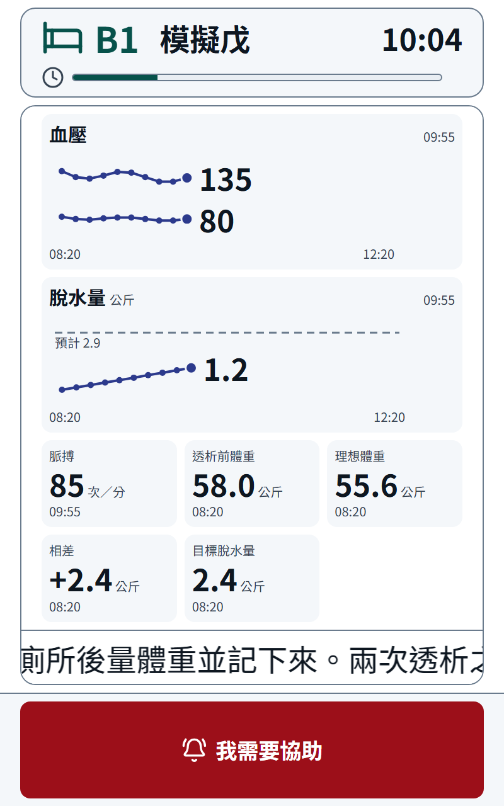

**B2 床「模擬己」，橫放 1280×800**

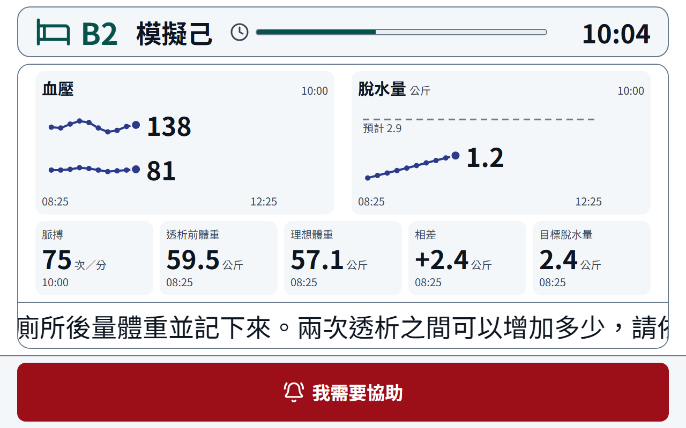

**B3 床「模擬庚」，直放 800×1280**

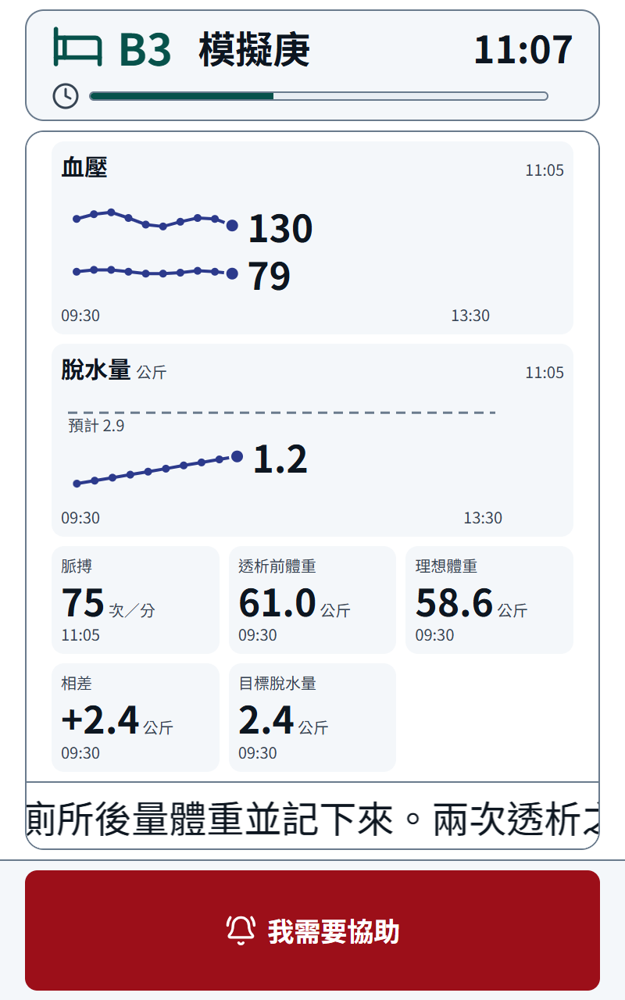

### 護理端簡易版：四位病人透析中

**1366×768**——中間一格一台平板，配了病人的四台右上角是床號（B1、B2、B3、A5），格子裡是病人與進度條；DEMO-02～04 空著。
右邊上面是病人框：右上角有折線圖示的三位（模擬丙、乙、甲）正在透析但沒有平板，排在最上面、越晚開始越上面，其餘依姓名筆畫；下面是公告與院內衛教。

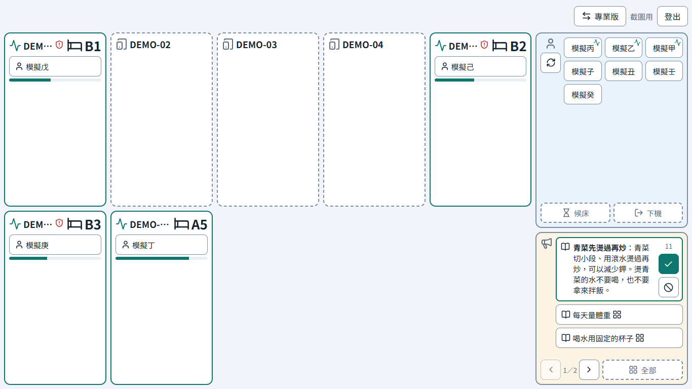

**1920×1080**——同一個畫面，平板排成一列。

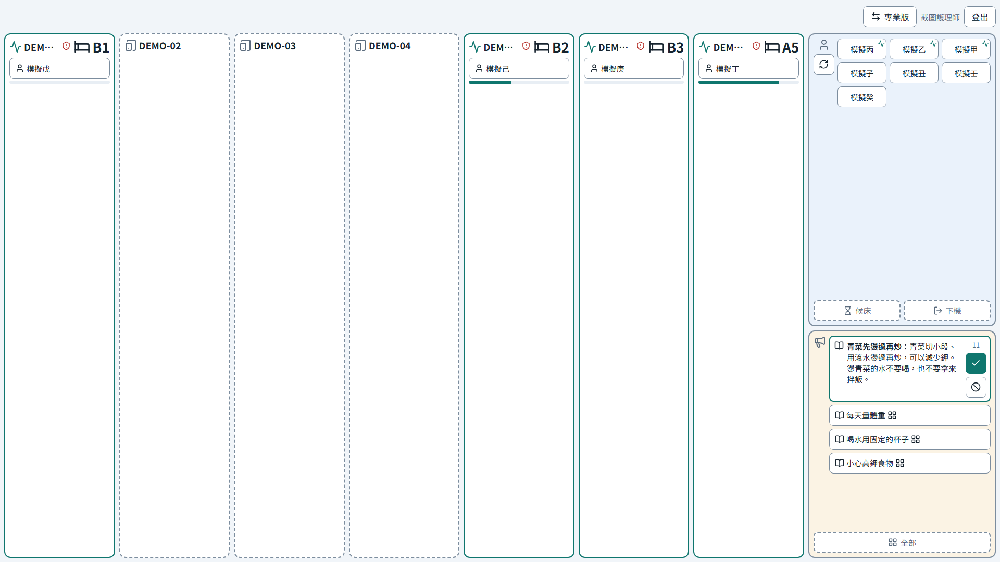

看圖時要知道的三件事：

- 使用中的平板序號被截成「DEM…」：右上角的床號佔了位置，序號放不下時截斷（迭代 17.2 的設計，滑鼠停著看得到全名）
- 序號旁的紅色盾牌是「平板沒有在固定畫面模式」：展示用的平板是開發機的瀏覽器，沒有裝外殼 App，本來就會出現
- **B1、B2、B3 的進度條都是四成多、A5 約八成**：模擬資料刻意讓 B1、B3 沒有預計結束時間，迭代 17.5 起照開始後四小時算，與有預計結束的 B2 一樣長，也與病人平板上的進度條一致（17.4 時 B1、B3 幾乎是空的，見問題第 14 項）

### 護理端專業版：即時總覽與總覽螢幕（迭代 17.5 追加之後）

1007 迭代 17.5 追加「專業版也全面套用四小時」之後，重開一次 `npm run demo:patient`、配好同樣四位病人，11:29 前後截的圖（與上面那幾張不是同一輪，時間晚約 20 分鐘）。

**即時總覽，1366×768**——「療程進度」那一欄的時間是**從透析開始算起**（模擬戊 09:40 開始、11:28 看是 1小時48分），進度條是佔四小時的比例；17.5 以前這一欄從平板配上的時間算，剛配上的四位都會接近 0。

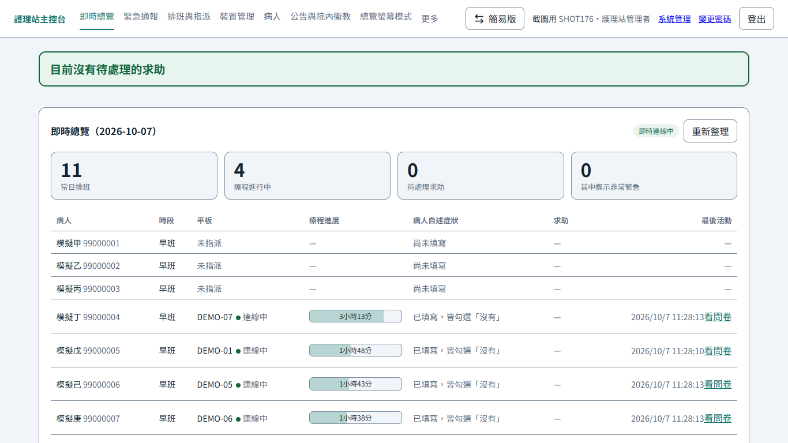

**總覽螢幕模式，1366×768**——磚塊的進度條與「已進行 X 小時 Y 分」和即時總覽相同。

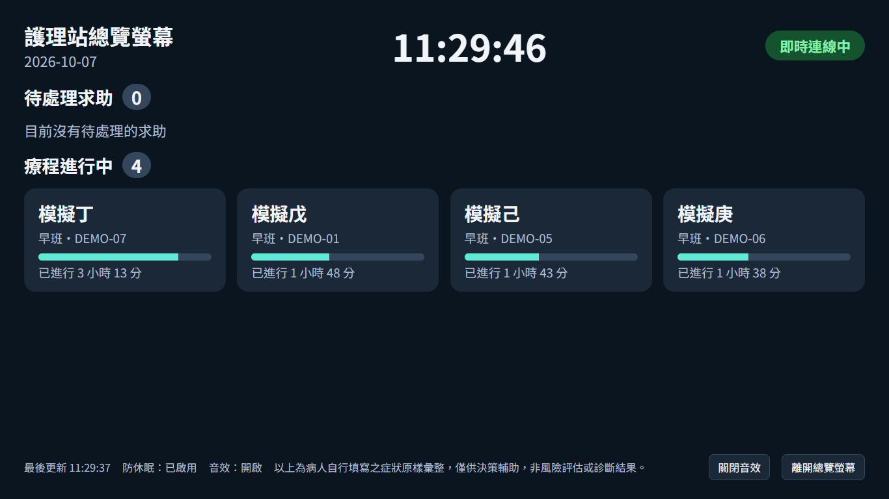

### 護理端：迭代 17.6 之後

1007 迭代 17.6 完成後，另開一次 `npm run demo:patient`（只配了 DEMO-01 一台，與上面幾張不是同一輪），16:30 前後以無頭 Chrome 1366×768 截的圖。
上面「四位病人透析中」那兩張是 17.6 以前截的，公告與院內衛教框裡的「＋」還在清單第一格。

**簡易版：草稿換到第二則**——展示資料庫帶進來的衛教草稿加上要的三份公告，共 14 則待核准；卡底下「‹ 2／14 ›」。「＋」在框左欄喇叭圖示底下，已核准的「每天量體重」整格看得到。

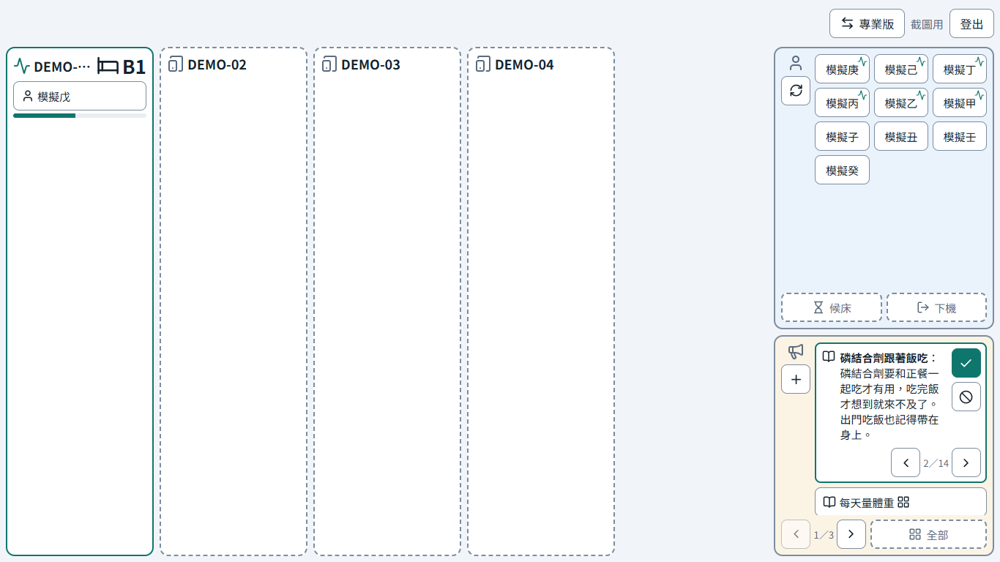

**專業版「新增裝置」**——主列六項（沒有「病人」）；只有註冊新平板與平板清單，清單沒有操作按鈕。

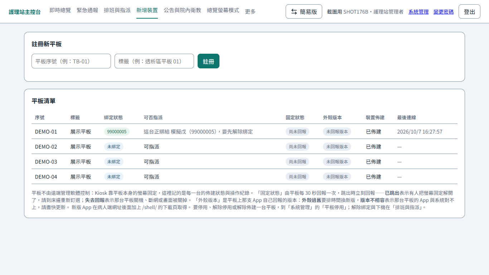

**系統管理「平板停用」**——每一台有停用與解除佈建；正在服務病人的 DEMO-01 只能解除佈建。

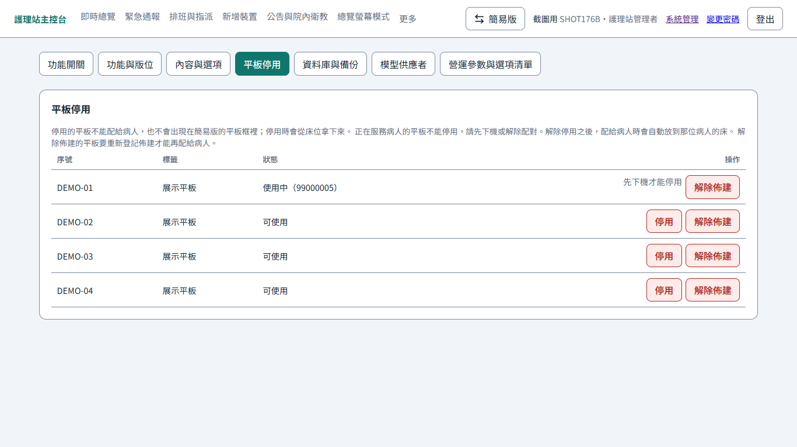

**排班與指派**——病人下拉選單旁的「重新整理」。選單的順序是模擬庚、己、戊、丁、丙、乙、甲（正在透析，越晚開始越上面），接著模擬子、丑、壬、癸（筆畫），與簡易版病人框相同（下拉選單展開的樣子截不到，順序由腳本讀出）。

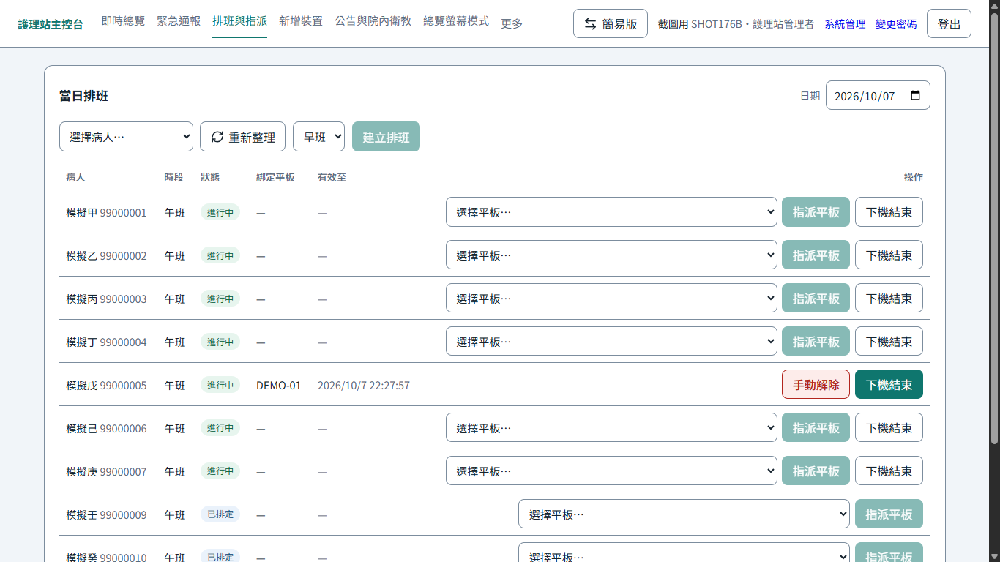

---

參考：[進度首頁](../index.md)
